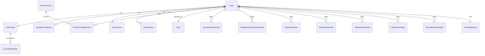

# Data Model

## Database Architecture

The Autrement Capable platform uses PostgreSQL as its primary database with SQLAlchemy ORM for data management. The database is designed to support user authentication, personalization, and comprehensive game data storage.

## Entity Relationship Overview



## Core User Management

### User Table
**Primary entity for all platform users**

| Column | Type | Description |
|--------|------|-------------|
| `id` | Integer (PK) | Unique user identifier |
| `username` | String (Unique) | Optional username for display |
| `date_created` | DateTime | Account creation timestamp |
| `is_active` | Boolean | Account status flag |
| `last_login` | DateTime | Last login timestamp |
| `is_passkey` | Boolean | Uses passwordless authentication |
| `onboarding_complete` | Boolean | Completed onboarding flow |
| `role_id` | Integer (FK) | Reference to user role |

**Relationships:**
- One-to-One: UserDetail, UserPicture, UserAvatarInfo
- One-to-Many: PasskeyCredential, UserPassion, UserTermsAgreement
- One-to-Many: All game data tables

### UserDetail Table
**Extended user information and optional traditional auth**

| Column | Type | Description |
|--------|------|-------------|
| `id` | Integer (PK) | Unique detail record ID |
| `user_id` | Integer (FK) | Reference to User |
| `first_name` | String | User's first name |
| `last_name` | String | User's last name |
| `age` | Integer | User's age |
| `phone_number` | String | Contact phone |
| `address` | String | Physical address |
| `email` | String (Unique) | Email for traditional auth |
| `password_hash` | String | Hashed password (optional) |

### Role Table
**User permission and access control**

| Column | Type | Description |
|--------|------|-------------|
| `id` | Integer (PK) | Unique role identifier |
| `role_name` | String (Unique) | Role name (e.g., "user", "admin") |
| `description` | String | Role description |

## Authentication & Security

### PasskeyCredential Table
**WebAuthn/Passkey authentication data**

| Column | Type | Description |
|--------|------|-------------|
| `id` | Integer (PK) | Unique credential ID |
| `credential_id` | String (Unique) | WebAuthn credential identifier |
| `public_key` | LargeBinary | Public key for verification |
| `sign_count` | Integer | Authentication counter |
| `device_type` | String | Device type information |
| `date_created` | DateTime | Credential creation date |
| `last_used` | DateTime | Last authentication time |
| `user_id` | Integer (FK) | Reference to User |

### RevokedToken Table
**JWT token blacklist for security**

| Column | Type | Description |
|--------|------|-------------|
| `jti` | String (PK) | JWT token identifier |
| `date_revoked` | DateTime | Revocation timestamp |
| `data_expires` | DateTime | Token expiration time |
| `type` | String | Token type |

### AccountRecovery Table
**Account recovery and password reset**

| Column | Type | Description |
|--------|------|-------------|
| `id` | Integer (PK) | Unique recovery ID |
| `reset_token` | String (Unique) | Recovery token |
| `token_expires` | DateTime | Token expiration |
| `date_requested` | DateTime | Request timestamp |
| `user_id` | Integer (FK) | Reference to User |

## User Personalization

### UserPicture Table
**User profile and avatar images**

| Column | Type | Description |
|--------|------|-------------|
| `id` | Integer (PK) | Unique picture ID |
| `user_id` | Integer (FK) | Reference to User |
| `picture_data` | LargeBinary | Image binary data |
| `date_updated` | DateTime | Last update time |
| `type` | String | Picture type ("profile", "cover") |

**Constraints:** Unique constraint on (user_id, type)

### UserAvatarInfo Table
**AI-generated avatar configuration**

| Column | Type | Description |
|--------|------|-------------|
| `id` | Integer (PK) | Unique avatar ID |
| `user_id` | Integer (FK) | Reference to User |
| `avatarGender` | String | Avatar gender selection |
| `avatarAccessories` | String | Avatar accessories |
| `avatarColor` | String | Avatar color scheme |
| `avatarPassions` | String | Avatar passion indicators |
| `avatarExpression` | String | Avatar emotional expression |

### UserPassion Table
**User interests and career preferences**

| Column | Type | Description |
|--------|------|-------------|
| `id` | Integer (PK) | Unique passion ID |
| `user_id` | Integer (FK) | Reference to User |
| `passion_text` | String | Passion description |
| `order` | Integer | Priority order (1, 2, 3) |

## Terms and Compliance

### TermsVersion Table
**Platform terms and conditions versioning**

| Column | Type | Description |
|--------|------|-------------|
| `id` | Integer (PK) | Unique terms version ID |
| `version` | String (Unique) | Version identifier |
| `content` | String | Markdown content |
| `is_active` | Boolean | Current active version |
| `date_created` | DateTime | Creation timestamp |

### UserTermsAgreement Table
**User acceptance of terms**

| Column | Type | Description |
|--------|------|-------------|
| `id` | Integer (PK) | Unique agreement ID |
| `user_id` | Integer (FK) | Reference to User |
| `terms_id` | Integer (FK) | Reference to TermsVersion |
| `date_agreed` | DateTime | Agreement timestamp |

## Game Data Models

All game tables follow a similar pattern with user_id foreign key and JSON data storage for flexibility.

### ScenarioGameData Table
**Emotional intelligence workplace scenarios**

| Column | Type | Description |
|--------|------|-------------|
| `id` | Integer (PK) | Unique game data ID |
| `user_id` | Integer (FK) | Reference to User |
| `current_level` | Integer | Current level progress |
| `completion` | Float | Completion percentage |
| `traits` | JSON | Emotional traits assessment |
| `penalties` | JSON | Performance tracking |

**Example JSON structure:**
```json
{
  "traits": {
    "empathy": 4,
    "diplomacy": 3,
    "assertiveness": 2,
    "pragmatism": 5
  },
  "penalties": {
    "timeouts": 1,
    "incorrect_responses": 3
  }
}
```

### ShapeSequenceGameData Table
**Logical thinking pattern recognition**

| Column | Type | Description |
|--------|------|-------------|
| `id` | Integer (PK) | Unique game data ID |
| `user_id` | Integer (FK) | Reference to User |
| `completion` | Float | Completion percentage |
| `levelResults` | JSON | Level-by-level results |
| `current_level` | Integer | Current level progress |

### JobsGameData Table
**Career interest exploration (Passion Explorer)**

| Column | Type | Description |
|--------|------|-------------|
| `id` | Integer (PK) | Unique game data ID |
| `user_id` | Integer (FK) | Reference to User |
| `completion` | Float | Completion percentage |
| `jobChoices` | JSON | Job ratings and preferences |

### SpeedGameData Table
**Typing ability and motor skills assessment**

| Column | Type | Description |
|--------|------|-------------|
| `id` | Integer (PK) | Unique game data ID |
| `user_id` | Integer (FK) | Reference to User |
| `current_level` | Integer | Current difficulty level |
| `completion` | Float | Completion percentage |
| `levelStats` | JSON | Performance statistics |

### AbilitiesGameData Table
**Soft skills self-assessment**

| Column | Type | Description |
|--------|------|-------------|
| `id` | Integer (PK) | Unique game data ID |
| `user_id` | Integer (FK) | Reference to User |
| `completion` | Float | Completion percentage |
| `skillAssessment` | JSON | Skill evaluation data |

### SkillsGameData Table
**Technical and professional skills assessment**

| Column | Type | Description |
|--------|------|-------------|
| `id` | Integer (PK) | Unique game data ID |
| `user_id` | Integer (FK) | Reference to User |
| `completion` | Float | Completion percentage |
| `skillsAssessment` | JSON | Skills evaluation data |

### RoomEnvGameData Table
**Ideal work environment customization**

| Column | Type | Description |
|--------|------|-------------|
| `id` | Integer (PK) | Unique game data ID |
| `user_id` | Integer (FK) | Reference to User |
| `completion` | Float | Completion percentage |
| `roomData` | JSON | 3D room configuration |

**Example JSON structure:**
```json
{
  "roomData": [
    {
      "objectType": "lighting",
      "setting": "bright",
      "position": {"x": 10, "y": 5, "z": 3}
    },
    {
      "objectType": "furniture",
      "type": "desk",
      "position": {"x": 0, "y": 0, "z": 0}
    }
  ]
}
```

## Data Patterns and Design Decisions

### JSON Storage Strategy
- **Flexibility**: Game schemas can evolve without database migrations
- **Performance**: Minimal impact for user-specific data queries
- **Simplicity**: Easier development and maintenance for game data

### Privacy by Design
- **No Sensitive Data**: No personal health information stored
- **User Control**: Users can delete their data at any time
- **Encryption**: Sensitive fields use application-level encryption

### Accessibility Considerations
- **Unicode Support**: Full UTF-8 support for international users
- **Audit Trails**: Track user agreement to terms and privacy policies
- **Data Export**: Users can export their profile data

### Scalability Patterns
- **Foreign Key Constraints**: Maintain data integrity
- **Indexed Fields**: Optimized for common query patterns
- **Lazy Loading**: Relationships loaded on demand
- **Connection Pooling**: Async database connections

## Database Operations

### Common Query Patterns
```sql
-- Get user with all game data
SELECT u.*, sg.*, shg.*, jg.* 
FROM users u
LEFT JOIN scenario_game_data sg ON u.id = sg.user_id
LEFT JOIN shape_sequence_game_data shg ON u.id = shg.user_id
LEFT JOIN jobs_game_data jg ON u.id = jg.user_id
WHERE u.id = ?;

-- Get user profile completion
SELECT u.username, 
       CASE WHEN u.onboarding_complete THEN 1 ELSE 0 END as onboarding,
       COUNT(DISTINCT sg.id) as games_completed
FROM users u
LEFT JOIN scenario_game_data sg ON u.id = sg.user_id AND sg.completion > 0
WHERE u.id = ?;
```

### Data Migration Strategy
- **Schema Versioning**: Track database version for migrations
- **Backward Compatibility**: New columns with defaults
- **JSON Schema Evolution**: Validate JSON structure in application layer

---

*This data model supports the flexible, user-centric design of the Autrement Capable platform while maintaining data integrity and privacy.*