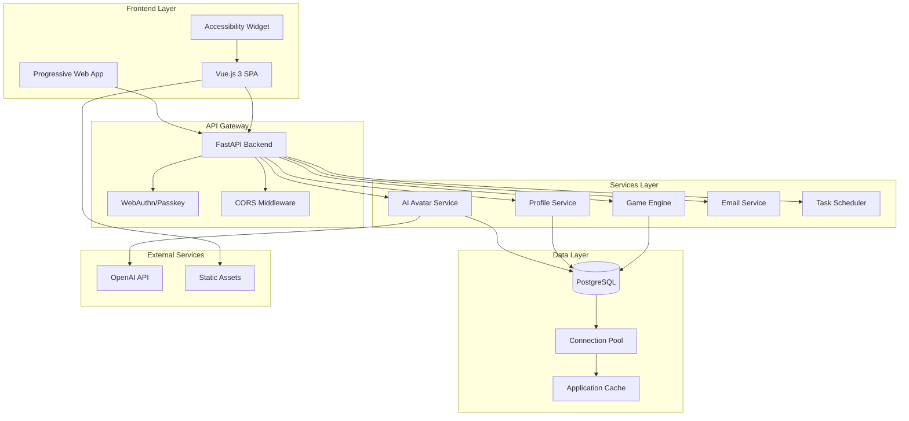
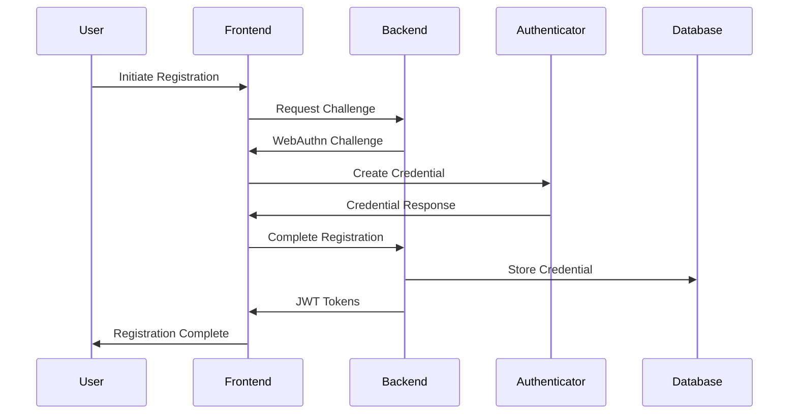

# Technical Architecture

## System Overview

Autrement Capable is built as a modern, scalable web application with a clear separation between frontend and backend services. The architecture prioritizes accessibility, security, and maintainability.

## Architecture Diagram



## Technology Stack

### Frontend Technologies

| Component | Technology | Version | Purpose |
|-----------|------------|---------|---------|
| **Framework** | Vue.js | 3.2.13 | Reactive UI framework |
| **Routing** | Vue Router | 4.0.3 | Client-side navigation |
| **Styling** | TailwindCSS | 4.0.3 | Utility-first CSS framework |
| **3D Graphics** | Three.js | 0.173.0 | 3D environment rendering |
| **3D Integration** | TresJS | 4.3.3 | Vue 3 Three.js integration |
| **State Management** | Mitt | 3.0.1 | Event emitter for state |
| **HTTP Client** | Axios | 1.7.9 | API communication |
| **Charts** | ApexCharts | 4.5.0 | Data visualization |
| **Authentication** | SimpleWebAuthn | 13.1.0 | WebAuthn client |
| **Build Tool** | Vue CLI | 5.0.0 | Development and build |

### Backend Technologies

| Component | Technology | Version | Purpose |
|-----------|------------|---------|---------|
| **Framework** | FastAPI | Latest | High-performance API framework |
| **Runtime** | Python | 3.11+ | Core runtime environment |
| **Database** | PostgreSQL | 15+ | Primary data store |
| **ORM** | SQLAlchemy | 2.0+ | Database abstraction |
| **Async DB** | AsyncPG | Latest | Async PostgreSQL driver |
| **Authentication** | WebAuthn | Latest | Passwordless authentication |
| **JWT** | PyJWT | Latest | Token-based auth |
| **AI Integration** | OpenAI | Latest | Avatar generation |
| **Task Scheduling** | APScheduler | Latest | Background tasks |
| **Email** | FastAPI-Mail | Latest | Email notifications |
| **Testing** | pytest | Latest | Test framework |

### Infrastructure & DevOps

| Component | Technology | Purpose |
|-----------|------------|---------|
| **Containerization** | Docker | Application packaging |
| **Orchestration** | Docker Compose | Local development |
| **CI/CD** | GitHub Actions | Automated deployment |
| **Web Server** | Uvicorn | ASGI server |
| **Reverse Proxy** | Nginx | Production web server |
| **Process Manager** | Gunicorn | Production process management |

## Application Architecture

### Frontend Architecture

#### Component Structure
```
src/
├── components/
│   ├── common/           # Reusable UI components
│   ├── accessibility/    # Accessibility-specific components
│   ├── games/           # Game-specific components
│   └── ui/              # Base UI elements
├── views/
│   ├── auth/            # Authentication pages
│   ├── games/           # Game interfaces
│   ├── profile/         # User profile pages
│   └── dashboard/       # Main dashboard
├── router/              # Vue Router configuration
├── services/            # API service layer
├── utils/               # Utility functions
└── assets/              # Static assets
```

#### State Management Pattern
- **Centralized Events**: Mitt event emitter for cross-component communication
- **Local State**: Vue 3 Composition API for component state
- **Persistent Storage**: Local storage for user preferences
- **API State**: Axios interceptors for request/response handling

#### Accessibility Architecture
- **Widget-based**: Floating accessibility controls
- **Runtime Adaptation**: Dynamic UI adjustments
- **Preference Persistence**: Settings saved across sessions
- **WCAG Compliance**: Level AA conformance target

### Backend Architecture

#### Service Layer Pattern
```
app/
├── api/
│   ├── auth/            # Authentication endpoints
│   ├── data/            # Game data endpoints
│   └── dev/             # Development endpoints
├── core/
│   ├── application.py   # FastAPI app configuration
│   ├── config.py        # Configuration management
│   ├── security/        # Security middleware
│   └── cors/            # CORS configuration
├── db/
│   ├── models/          # Database models
│   ├── repositories/    # Data access layer
│   └── postgress/       # PostgreSQL specific code
├── services/
│   ├── auth/            # Authentication services
│   ├── scheduler/       # Background tasks
│   └── content/         # Content management
└── utils/               # Utility functions
```

#### Repository Pattern
- **Data Access Abstraction**: Clean separation between business logic and data access
- **Async Operations**: Full async/await support for database operations
- **Transaction Management**: Automatic transaction handling
- **Error Handling**: Centralized database error management

#### Security Architecture
- **WebAuthn Integration**: Hardware-backed authentication
- **JWT Tokens**: Stateless authentication with refresh tokens
- **CORS Protection**: Configured cross-origin resource sharing
- **Input Validation**: Pydantic models for request validation
- **SQL Injection Prevention**: Parameterized queries via SQLAlchemy

## Security Model

### Authentication Flow


### Security Features

| Feature | Implementation | Purpose |
|---------|----------------|---------|
| **Passwordless Auth** | WebAuthn/FIDO2 | Eliminate password vulnerabilities |
| **Hardware Security** | Platform authenticators | Phishing-resistant authentication |
| **Token Management** | JWT with refresh rotation | Secure session management |
| **Data Encryption** | AES encryption for sensitive data | Protect user information |
| **HTTPS Enforcement** | TLS 1.3 | Encrypt data in transit |
| **CORS Protection** | Origin validation | Prevent unauthorized API access |
| **Input Sanitization** | Pydantic validation | Prevent injection attacks |
| **Rate Limiting** | Request throttling | Prevent abuse |

## Performance Architecture

### Frontend Performance
- **Code Splitting**: Dynamic imports for games and features
- **Lazy Loading**: Components loaded on demand
- **Asset Optimization**: Compressed images and fonts
- **Caching Strategy**: Browser caching for static assets
- **Progressive Loading**: Skeleton screens during data fetch

### Backend Performance
- **Async Architecture**: Non-blocking I/O operations
- **Connection Pooling**: Efficient database connections
- **Query Optimization**: Indexed queries and eager loading
- **Response Compression**: Gzip compression for API responses
- **Background Tasks**: Async job processing for non-critical operations

### Database Performance
- **Indexing Strategy**: Optimized indexes for common queries
- **Connection Pooling**: AsyncPG connection pool
- **Query Optimization**: SQLAlchemy query optimization
- **Data Normalization**: Balanced normalization for performance

## Scalability Considerations

### Horizontal Scaling
- **Stateless Design**: No server-side session storage
- **Database Clustering**: Support for PostgreSQL clusters
- **Load Balancing**: Application-level load balancing ready
- **CDN Integration**: Static asset distribution

### Vertical Scaling
- **Resource Optimization**: Efficient memory usage
- **CPU Optimization**: Async processing reduces CPU blocking
- **Database Tuning**: Optimized PostgreSQL configuration
- **Caching Strategy**: Application-level caching

## Development Architecture

### Code Organization
- **Domain-Driven Design**: Organized by business domains
- **Separation of Concerns**: Clear layer separation
- **Dependency Injection**: Configurable service dependencies
- **Interface Abstraction**: Service interfaces for testing

### Testing Strategy
- **Unit Tests**: Component and service level tests
- **Integration Tests**: API endpoint testing
- **E2E Tests**: Complete user flow testing
- **Accessibility Testing**: Automated accessibility validation

### Code Quality
- **Linting**: ESLint for frontend, Pylint for backend
- **Formatting**: Prettier for frontend, Black for backend
- **Type Checking**: TypeScript annotations, Python type hints
- **Documentation**: Comprehensive inline documentation

## Deployment Architecture

### Container Strategy
```dockerfile
# Multi-stage build example
FROM node:18-alpine AS frontend-builder
WORKDIR /app
COPY website/package*.json ./
RUN npm ci --only=production
COPY website/ ./
RUN npm run build

FROM python:3.11-slim AS backend
WORKDIR /app
COPY Backend/requirements.txt ./
RUN pip install --no-cache-dir -r requirements.txt
COPY Backend/ ./
COPY --from=frontend-builder /app/dist ./static
```

### Environment Configuration
- **Environment Variables**: 12-factor app configuration
- **Config Management**: YAML configuration files
- **Secret Management**: Environment-based secrets
- **Feature Flags**: Runtime feature toggling

### Monitoring & Observability
- **Health Checks**: Application health endpoints
- **Logging**: Structured logging with correlation IDs
- **Metrics**: Application performance metrics
- **Error Tracking**: Centralized error reporting

---

*This technical architecture provides a robust, scalable foundation for the Autrement Capable platform while maintaining simplicity and accessibility.*