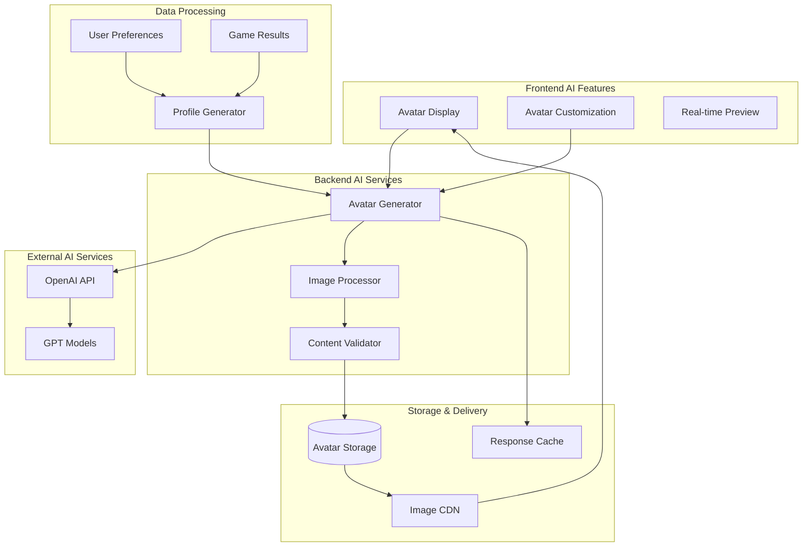
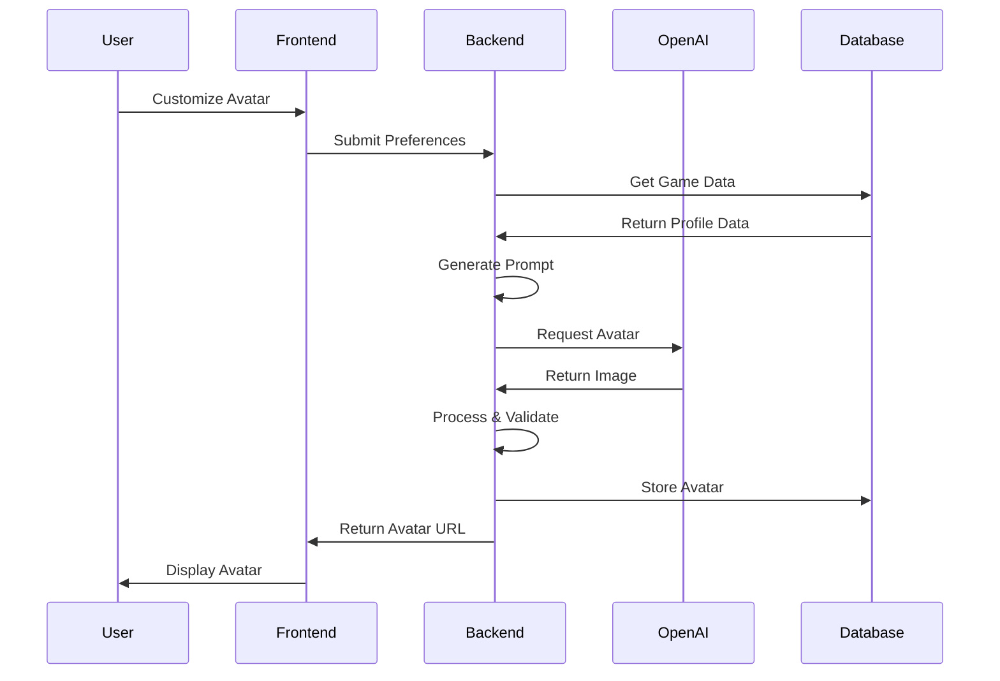
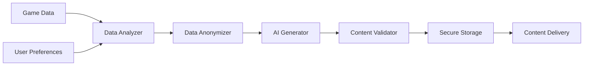

# AI Engine Architecture

## AI Integration Overview

The Autrement Capable platform integrates artificial intelligence primarily for avatar generation and personalization features. The AI system is designed to be lightweight, privacy-focused, and specifically tailored for neurodivergent users.

## AI Architecture Diagram



## AI Components

### 1. Avatar Generation Engine

#### Purpose
Generate personalized avatars based on user preferences and game data to help users identify with their digital representation.

#### Technical Implementation
- **Integration**: OpenAI API for image generation
- **Input Processing**: User preferences, game results, accessibility needs
- **Output**: High-quality avatar images in multiple formats (AVIF, WebP, PNG)
- **Caching**: Generated avatars cached for performance

#### Avatar Configuration Model
```typescript
interface AvatarConfiguration {
  avatarGender: string;           // User's gender preference
  avatarAccessories: string;      // Accessories selection
  avatarColor: string;           // Color scheme preferences
  avatarPassions: string;        // Career interests indicators
  avatarExpression: string;      // Emotional expression
  // Generated from game data:
  personalityTraits: object;     // From scenario game
  skillLevel: object;           // From skills assessment
  environmentPrefs: object;     // From environment game
}
```

#### Generation Pipeline


### 2. Profile Personalization Engine

#### Purpose
Analyze user interactions across all mini-games to generate personalized insights and recommendations.

#### Data Sources
- **Scenario Game**: Emotional intelligence patterns
- **Shape Sequence Game**: Logical thinking abilities
- **Jobs Game**: Career interests and preferences
- **Speed Game**: Motor skills and typing proficiency
- **Abilities Game**: Self-assessed skills
- **Skills Game**: Technical capabilities
- **Room Environment Game**: Workplace preferences

#### Personalization Algorithm
```python
class ProfilePersonalizer:
    def analyze_user_profile(self, user_data: UserGameData) -> PersonalizedProfile:
        """
        Generate personalized insights from game data
        """
        insights = {
            'strengths': self._identify_strengths(user_data),
            'interests': self._extract_interests(user_data),
            'work_style': self._analyze_work_preferences(user_data),
            'skill_gaps': self._identify_development_areas(user_data),
            'recommendations': self._generate_recommendations(user_data)
        }
        return PersonalizedProfile(**insights)
    
    def _identify_strengths(self, data: UserGameData) -> List[str]:
        """Extract user strengths from game performance"""
        # Analysis logic for identifying patterns
        pass
    
    def _generate_recommendations(self, data: UserGameData) -> List[Recommendation]:
        """Generate career and development recommendations"""
        # ML-based recommendation logic
        pass
```

### 3. Content Validation & Safety

#### Purpose
Ensure all AI-generated content is appropriate, inclusive, and safe for neurodivergent users.

#### Validation Rules
- **Inclusivity**: Avatars represent diverse appearances and abilities
- **Appropriateness**: Content suitable for all users
- **Accessibility**: Generated content supports accessibility features
- **Privacy**: No personal identifiers in generated content

#### Safety Measures
```python
class ContentValidator:
    def validate_avatar(self, avatar_data: bytes) -> ValidationResult:
        """
        Validate generated avatar for safety and appropriateness
        """
        checks = [
            self._check_appropriateness(avatar_data),
            self._check_inclusivity(avatar_data),
            self._check_accessibility_compliance(avatar_data),
            self._scan_for_inappropriate_content(avatar_data)
        ]
        return ValidationResult(all(checks), checks)
```

## AI Models and Services

### OpenAI Integration

#### Configuration
- **Model**: DALL-E for image generation
- **API Version**: Latest stable version
- **Rate Limiting**: Implemented to prevent abuse
- **Error Handling**: Graceful fallbacks for service unavailability

#### Prompt Engineering
```python
def generate_avatar_prompt(user_config: AvatarConfiguration) -> str:
    """
    Generate optimized prompt for avatar creation
    """
    base_prompt = "Create a friendly, inclusive avatar representing a young person"
    
    # Add user preferences
    if user_config.avatarGender:
        base_prompt += f" with {user_config.avatarGender} characteristics"
    
    # Add personality traits from games
    if user_config.personalityTraits:
        traits = extract_key_traits(user_config.personalityTraits)
        base_prompt += f" showing {', '.join(traits)} personality"
    
    # Add style preferences
    base_prompt += f" in {user_config.avatarColor} color scheme"
    base_prompt += f" with {user_config.avatarExpression} expression"
    
    # Add accessibility requirements
    base_prompt += " ensuring high contrast and clear features for accessibility"
    
    return base_prompt
```

### Local AI Processing

#### Image Processing Pipeline
- **Format Optimization**: Convert to AVIF/WebP for performance
- **Accessibility Enhancement**: Ensure sufficient contrast
- **Size Optimization**: Multiple resolutions for different use cases
- **Quality Validation**: Automated quality checks

#### Performance Optimization
```python
class ImageProcessor:
    def __init__(self):
        self.supported_formats = ['avif', 'webp', 'png']
        self.quality_settings = {
            'avif': 70,
            'webp': 80,
            'png': 95
        }
    
    async def process_avatar(self, raw_image: bytes) -> ProcessedAvatar:
        """
        Process and optimize avatar image
        """
        # Resize to multiple resolutions
        sizes = [64, 128, 256, 512]
        processed_images = {}
        
        for size in sizes:
            for format_type in self.supported_formats:
                processed_images[f"{size}_{format_type}"] = await self._resize_and_convert(
                    raw_image, size, format_type
                )
        
        return ProcessedAvatar(processed_images)
```

## Data Flow and Privacy

### Data Processing Pipeline


### Privacy Protection
- **Data Anonymization**: Personal identifiers removed before AI processing
- **Local Processing**: Avatar customization processed locally when possible
- **Temporary Storage**: AI requests stored temporarily and automatically deleted
- **User Control**: Users can regenerate or delete avatars at any time

### Data Retention Policy
```python
class AIDataRetention:
    RETENTION_PERIODS = {
        'avatar_generation_requests': timedelta(days=7),
        'processing_logs': timedelta(days=30),
        'error_logs': timedelta(days=90),
        'user_preferences': 'indefinite_with_user_control'
    }
    
    async def cleanup_expired_data(self):
        """Automatically clean up expired AI-related data"""
        for data_type, retention_period in self.RETENTION_PERIODS.items():
            if retention_period != 'indefinite_with_user_control':
                await self._delete_expired_records(data_type, retention_period)
```

## Performance and Scalability

### Caching Strategy
- **Avatar Cache**: Generated avatars cached for 30 days
- **Prompt Cache**: Common prompts cached to reduce API calls
- **Response Cache**: API responses cached for identical requests
- **CDN Integration**: Static avatar delivery through CDN

### Rate Limiting and Cost Management
```python
class AIRateLimiter:
    def __init__(self):
        self.user_limits = {
            'avatar_generations_per_day': 10,
            'avatar_modifications_per_hour': 5
        }
    
    async def check_rate_limit(self, user_id: int, action: str) -> bool:
        """Check if user can perform AI action within limits"""
        current_usage = await self._get_current_usage(user_id, action)
        limit = self.user_limits.get(action)
        return current_usage < limit if limit else True
```

### Error Handling and Fallbacks
- **Service Unavailability**: Graceful degradation with cached avatars
- **API Failures**: Retry logic with exponential backoff
- **Content Validation Failures**: Default to safe, generic avatars
- **Rate Limit Exceeded**: Queue requests for later processing

## Future AI Enhancements

### Phase 2: Enhanced Personalization
- **Career Matching**: AI-powered job recommendation engine
- **Learning Path Suggestions**: Personalized skill development recommendations
- **Adaptive Interfaces**: AI-driven accessibility adaptations

### Phase 3: Advanced AI Features
- **Natural Language Processing**: Chat-based career guidance
- **Predictive Analytics**: Early intervention for user engagement
- **Computer Vision**: Accessibility analysis of user environment

### Phase 4: Community AI
- **Peer Matching**: Connect users with similar profiles
- **Mentor Recommendations**: AI-powered mentor-mentee matching
- **Success Prediction**: Identify optimal career paths

## Monitoring and Analytics

### AI Performance Metrics
- **Generation Success Rate**: Percentage of successful avatar generations
- **User Satisfaction**: Rating of generated avatars
- **Processing Time**: Average time for avatar generation
- **API Usage**: Cost tracking and optimization opportunities

### Quality Assurance
```python
class AIQualityMonitor:
    def __init__(self):
        self.metrics = {
            'generation_success_rate': MetricTracker(),
            'user_satisfaction_score': MetricTracker(),
            'content_safety_score': MetricTracker(),
            'accessibility_compliance': MetricTracker()
        }
    
    async def track_generation_quality(self, result: GenerationResult):
        """Track quality metrics for AI generations"""
        self.metrics['generation_success_rate'].record(result.success)
        if result.user_rating:
            self.metrics['user_satisfaction_score'].record(result.user_rating)
```

---

*The AI architecture prioritizes user privacy, accessibility, and personalization while maintaining high performance and cost efficiency.*