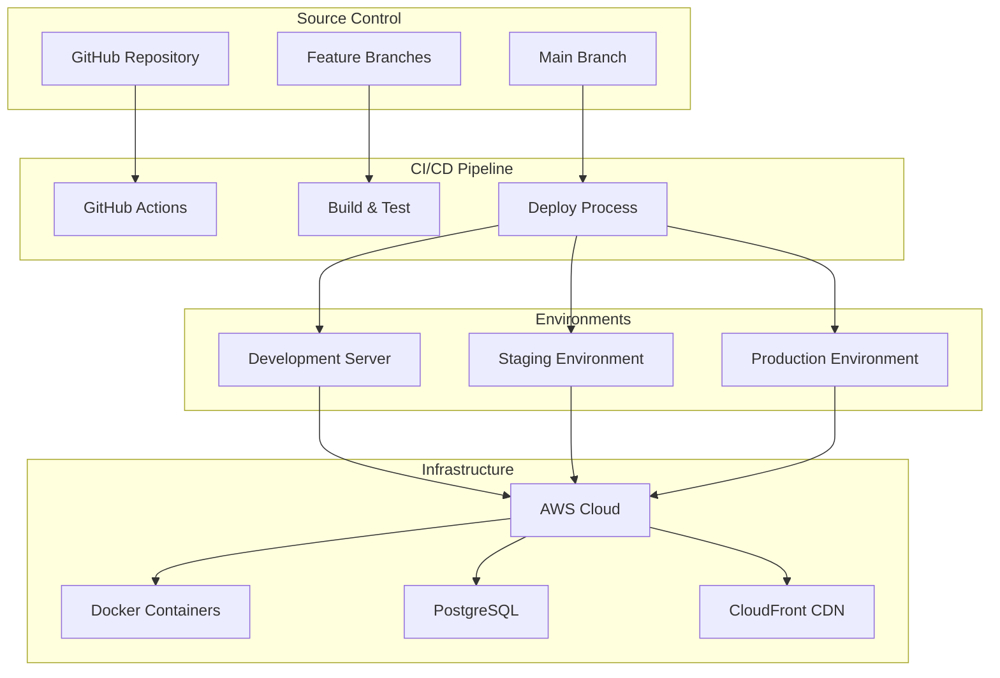

# Deployment Guide

## Deployment Overview

Autrement Capable supports multiple deployment environments with automated CI/CD pipelines. This guide covers deployment to development, staging, and production environments.

## Deployment Architecture



## Environment Overview

| Environment | Purpose | URL | Auto-Deploy | Trigger |
|-------------|---------|-----|-------------|---------|
| **Development** | Testing latest changes | https://dev.autrement-cap.fr | Yes | Push to main with `[DEPLOY]` |
| **Staging** | Pre-production testing | https://staging.autrement-cap.fr | Manual | Release branches |
| **Production** | Live application | https://autrement-cap.fr | Manual | Tagged releases |

## Automated Deployment (Development)

### GitHub Actions Workflow

The development server uses automated deployment triggered by commit messages.

#### Trigger Deployment
```bash
# Make your changes
git add .
git commit -m "Fix avatar generation issue [DEPLOY]"
git push origin main
```

#### Deployment Process
1. **Trigger Check**: GitHub Actions checks for `[DEPLOY]` in commit message
2. **Build**: Docker images built for backend and frontend
3. **Test**: Automated tests run on built images
4. **Deploy**: Images deployed to development server
5. **Health Check**: Verify deployment success

#### Current Deployment Configuration
```yaml
# .github/workflows/Deployment.yml (excerpt)
name: Deploy to Development Server

on:
  push:
    branches: [main]

jobs:
  deploy:
    runs-on: ubuntu-latest
    steps:
    - name: Check for [DEPLOY] in commit messages
      run: |
        if git log -1 --pretty=%B | grep -q "\[DEPLOY\]"; then
          echo "🚀 Found [DEPLOY] in commit message"
          echo "should_deploy=true" >> "$GITHUB_OUTPUT"
        fi
    
    - name: Deploy to server
      if: steps.check_deploy.outputs.should_deploy == 'true'
      run: |
        ssh $USER@$HOST << 'EOF'
          cd /code/AutrementCapable
          git pull origin main
          cd Backend
          docker compose down
          docker compose up -d --build
        EOF
```

## Manual Deployment

### Prerequisites

#### Development Tools
```bash
# Required tools for deployment
docker --version
docker-compose --version
ssh --version
git --version
```

#### Access Requirements
- SSH access to target server
- Docker registry access (if using private registry)
- Environment variable access
- SSL certificate management access

### Server Setup

#### Initial Server Configuration
```bash
# Update system
sudo apt update && sudo apt upgrade -y

# Install Docker
curl -fsSL https://get.docker.com -o get-docker.sh
sh get-docker.sh
sudo usermod -aG docker $USER

# Install Docker Compose
sudo curl -L "https://github.com/docker/compose/releases/latest/download/docker-compose-$(uname -s)-$(uname -m)" -o /usr/local/bin/docker-compose
sudo chmod +x /usr/local/bin/docker-compose

# Create application directory
sudo mkdir -p /opt/autrement-capable
sudo chown $USER:$USER /opt/autrement-capable
```

#### Application Deployment
```bash
# Clone repository
cd /opt/autrement-capable
git clone https://github.com/Autrement-capable/AutrementCapable.git .

# Set up environment
cp .env.example .env
# Edit .env with production values

# Build and start services
cd Backend
docker-compose -f docker-compose.prod.yml up -d --build
```

### Environment Configuration

#### Production Environment Variables
```bash
# Backend/.env.production
# Server Configuration
HOST=0.0.0.0
PORT=5000
DEBUG=False
MODE=PROD
VERSION=1.0.0

# Database Configuration
POSTGRES_SERVER=prod-db-host.amazonaws.com
POSTGRES_USER=autrement_capable_prod
POSTGRES_PASSWORD=secure_production_password
POSTGRES_DB=autrement_capable_prod
POSTGRES_PORT=5432

# Security Configuration
SERVER_SECRET=super_secure_production_secret_key
AES_KEY=production_aes_key_32_characters

# WebAuthn Configuration
RP_ID=autrement-cap.fr
ORIGIN=https://autrement-cap.fr

# SSL Configuration
SSL_CERT_PATH=/etc/ssl/certs/autrement-cap.crt
SSL_KEY_PATH=/etc/ssl/private/autrement-cap.key

# External Services
OPENAI_API_KEY=prod_openai_api_key
EMAIL_HOST=smtp.production-email.com
EMAIL_PORT=587
EMAIL_USER=noreply@autrement-cap.fr
EMAIL_PASSWORD=production_email_password

# Monitoring
SENTRY_DSN=https://your-sentry-dsn@sentry.io/project
```

#### Frontend Environment Variables
```bash
# website/.env.production
VUE_APP_SERVER_URL=https://api.autrement-cap.fr
VUE_APP_ENVIRONMENT=production
VUE_APP_DEBUG=false
VUE_APP_SENTRY_DSN=https://your-frontend-sentry-dsn@sentry.io/project
```

## Docker Deployment

### Production Docker Configuration

#### Docker Compose for Production
```yaml
# Backend/docker-compose.prod.yml
version: '3.8'

services:
  frontend:
    build:
      context: ../website
      dockerfile: Dockerfile.prod
    ports:
      - "80:80"
      - "443:443"
    volumes:
      - /etc/ssl:/etc/ssl:ro
      - ./nginx.conf:/etc/nginx/nginx.conf:ro
    depends_on:
      - backend
    networks:
      - app-network

  backend:
    build:
      context: .
      dockerfile: Dockerfile.prod
    environment:
      - HOST=0.0.0.0
      - PORT=5000
      - POSTGRES_SERVER=${POSTGRES_SERVER}
      - POSTGRES_USER=${POSTGRES_USER}
      - POSTGRES_PASSWORD=${POSTGRES_PASSWORD}
      - POSTGRES_DB=${POSTGRES_DB}
      - DEBUG=False
    volumes:
      - ./logs:/app/logs
    networks:
      - app-network
    depends_on:
      - db

  db:
    image: postgres:15
    environment:
      POSTGRES_USER: ${POSTGRES_USER}
      POSTGRES_PASSWORD: ${POSTGRES_PASSWORD}
      POSTGRES_DB: ${POSTGRES_DB}
    volumes:
      - postgres_data:/var/lib/postgresql/data
      - ./backups:/backups
    networks:
      - app-network
    restart: unless-stopped

  redis:
    image: redis:7-alpine
    volumes:
      - redis_data:/data
    networks:
      - app-network
    restart: unless-stopped

volumes:
  postgres_data:
  redis_data:

networks:
  app-network:
    driver: bridge
```

#### Production Dockerfile (Backend)
```dockerfile
# Backend/Dockerfile.prod
FROM python:3.11-slim as builder

WORKDIR /app
COPY requirements.txt .
RUN pip install --no-cache-dir -r requirements.txt

FROM python:3.11-slim

WORKDIR /app

# Copy Python dependencies
COPY --from=builder /usr/local/lib/python3.11/site-packages /usr/local/lib/python3.11/site-packages
COPY --from=builder /usr/local/bin /usr/local/bin

# Copy application code
COPY . .

# Create non-root user
RUN adduser --disabled-password --gecos '' appuser
RUN chown -R appuser:appuser /app
USER appuser

# Health check
HEALTHCHECK --interval=30s --timeout=10s --start-period=5s --retries=3 \
  CMD curl -f http://localhost:5000/health || exit 1

# Start application
CMD ["python", "-m", "uvicorn", "app.main:app", "--host", "0.0.0.0", "--port", "5000", "--workers", "4"]
```

#### Production Dockerfile (Frontend)
```dockerfile
# website/Dockerfile.prod
# Build stage
FROM node:18-alpine as builder

WORKDIR /app
COPY package*.json ./
RUN npm ci --only=production

COPY . .
RUN npm run build

# Production stage
FROM nginx:alpine

# Copy built application
COPY --from=builder /app/dist /usr/share/nginx/html

# Copy nginx configuration
COPY nginx.conf /etc/nginx/nginx.conf

# Add SSL support
RUN apk add --no-cache openssl

# Health check
HEALTHCHECK --interval=30s --timeout=10s --start-period=5s --retries=3 \
  CMD wget --no-verbose --tries=1 --spider http://localhost:80/health || exit 1

EXPOSE 80 443

CMD ["nginx", "-g", "daemon off;"]
```

### Deployment Commands

#### Build and Deploy
```bash
# Production deployment
cd Backend
docker-compose -f docker-compose.prod.yml down
docker-compose -f docker-compose.prod.yml build --no-cache
docker-compose -f docker-compose.prod.yml up -d

# Check deployment status
docker-compose -f docker-compose.prod.yml ps
docker-compose -f docker-compose.prod.yml logs -f

# Verify health
curl https://autrement-cap.fr/health
```

#### Rolling Update Deployment
```bash
#!/bin/bash
# rolling-deploy.sh

set -e

echo "Starting rolling deployment..."

# Build new images
docker-compose -f docker-compose.prod.yml build

# Update backend with zero downtime
docker-compose -f docker-compose.prod.yml up -d --no-deps backend

# Wait for health check
echo "Waiting for backend health check..."
for i in {1..30}; do
  if curl -f http://localhost:5000/health > /dev/null 2>&1; then
    echo "Backend is healthy"
    break
  fi
  sleep 2
done

# Update frontend
docker-compose -f docker-compose.prod.yml up -d --no-deps frontend

echo "Deployment completed successfully"
```

## AWS Cloud Deployment

### Infrastructure as Code

#### Terraform Configuration (Example)
```hcl
# infrastructure/main.tf
provider "aws" {
  region = "eu-west-1"
}

# VPC Configuration
resource "aws_vpc" "main" {
  cidr_block           = "10.0.0.0/16"
  enable_dns_hostnames = true
  enable_dns_support   = true

  tags = {
    Name = "autrement-capable-vpc"
  }
}

# ECS Cluster
resource "aws_ecs_cluster" "main" {
  name = "autrement-capable-cluster"

  setting {
    name  = "containerInsights"
    value = "enabled"
  }
}

# RDS PostgreSQL
resource "aws_db_instance" "main" {
  identifier             = "autrement-capable-db"
  engine                 = "postgres"
  engine_version        = "15.3"
  instance_class        = "db.t3.micro"
  allocated_storage     = 20
  max_allocated_storage = 100

  db_name  = "autrement_capable_prod"
  username = var.db_username
  password = var.db_password

  backup_retention_period = 7
  backup_window          = "03:00-04:00"
  maintenance_window     = "sun:04:00-sun:05:00"

  skip_final_snapshot = false
  final_snapshot_identifier = "autrement-capable-final-snapshot"

  tags = {
    Name = "autrement-capable-db"
  }
}

# Application Load Balancer
resource "aws_lb" "main" {
  name               = "autrement-capable-alb"
  internal           = false
  load_balancer_type = "application"
  security_groups    = [aws_security_group.alb.id]
  subnets           = aws_subnet.public[*].id

  enable_deletion_protection = true

  tags = {
    Name = "autrement-capable-alb"
  }
}
```

#### ECS Task Definition
```json
{
  "family": "autrement-capable-backend",
  "networkMode": "awsvpc",
  "requiresCompatibilities": ["FARGATE"],
  "cpu": "512",
  "memory": "1024",
  "executionRoleArn": "arn:aws:iam::account:role/ecsTaskExecutionRole",
  "taskRoleArn": "arn:aws:iam::account:role/ecsTaskRole",
  "containerDefinitions": [
    {
      "name": "backend",
      "image": "your-account.dkr.ecr.region.amazonaws.com/autrement-capable-backend:latest",
      "portMappings": [
        {
          "containerPort": 5000,
          "protocol": "tcp"
        }
      ],
      "environment": [
        {
          "name": "MODE",
          "value": "PROD"
        }
      ],
      "secrets": [
        {
          "name": "POSTGRES_PASSWORD",
          "valueFrom": "arn:aws:secretsmanager:region:account:secret:db-password"
        }
      ],
      "logConfiguration": {
        "logDriver": "awslogs",
        "options": {
          "awslogs-group": "/ecs/autrement-capable-backend",
          "awslogs-region": "eu-west-1",
          "awslogs-stream-prefix": "ecs"
        }
      },
      "healthCheck": {
        "command": ["CMD-SHELL", "curl -f http://localhost:5000/health || exit 1"],
        "interval": 30,
        "timeout": 5,
        "retries": 3,
        "startPeriod": 60
      }
    }
  ]
}
```

### CI/CD Pipeline for AWS

#### GitHub Actions for AWS Deployment
```yaml
# .github/workflows/aws-deploy.yml
name: Deploy to AWS

on:
  push:
    tags: ['v*']

env:
  AWS_REGION: eu-west-1
  ECR_REPOSITORY: autrement-capable

jobs:
  deploy:
    runs-on: ubuntu-latest
    
    steps:
    - name: Checkout
      uses: actions/checkout@v3

    - name: Configure AWS credentials
      uses: aws-actions/configure-aws-credentials@v2
      with:
        aws-access-key-id: ${{ secrets.AWS_ACCESS_KEY_ID }}
        aws-secret-access-key: ${{ secrets.AWS_SECRET_ACCESS_KEY }}
        aws-region: ${{ env.AWS_REGION }}

    - name: Login to Amazon ECR
      id: login-ecr
      uses: aws-actions/amazon-ecr-login@v1

    - name: Build and push backend image
      env:
        ECR_REGISTRY: ${{ steps.login-ecr.outputs.registry }}
        IMAGE_TAG: ${{ github.sha }}
      run: |
        cd Backend
        docker build -t $ECR_REGISTRY/$ECR_REPOSITORY-backend:$IMAGE_TAG .
        docker push $ECR_REGISTRY/$ECR_REPOSITORY-backend:$IMAGE_TAG

    - name: Build and push frontend image
      env:
        ECR_REGISTRY: ${{ steps.login-ecr.outputs.registry }}
        IMAGE_TAG: ${{ github.sha }}
      run: |
        cd website
        docker build -t $ECR_REGISTRY/$ECR_REPOSITORY-frontend:$IMAGE_TAG .
        docker push $ECR_REGISTRY/$ECR_REPOSITORY-frontend:$IMAGE_TAG

    - name: Deploy to ECS
      run: |
        aws ecs update-service \
          --cluster autrement-capable-cluster \
          --service autrement-capable-backend \
          --force-new-deployment
```

## Database Migration and Management

### Migration Strategy

#### Pre-deployment Database Backup
```bash
#!/bin/bash
# backup-db.sh

BACKUP_DIR="/backups/$(date +%Y%m%d_%H%M%S)"
mkdir -p $BACKUP_DIR

# Create database backup
docker-compose exec -T db pg_dump -U $POSTGRES_USER $POSTGRES_DB > $BACKUP_DIR/database.sql

# Create data export
docker-compose exec -T db pg_dump -U $POSTGRES_USER --data-only $POSTGRES_DB > $BACKUP_DIR/data-only.sql

# Compress backup
tar -czf $BACKUP_DIR.tar.gz $BACKUP_DIR
rm -rf $BACKUP_DIR

echo "Backup created: $BACKUP_DIR.tar.gz"
```

#### Database Migration Process
```bash
#!/bin/bash
# migrate-db.sh

set -e

echo "Starting database migration..."

# 1. Create backup
./backup-db.sh

# 2. Apply migrations
docker-compose exec backend python -m alembic upgrade head

# 3. Verify migration
docker-compose exec backend python -c "
from app.db.postgress.engine import postgress
import asyncio

async def verify():
    exists, missing = await postgress.check_all_models_exist()
    if exists:
        print('✅ All tables exist')
    else:
        print(f'❌ Missing tables: {missing}')
        exit(1)

asyncio.run(verify())
"

echo "Migration completed successfully"
```

## SSL/TLS Configuration

### Let's Encrypt SSL Setup
```bash
# Install Certbot
sudo apt install certbot python3-certbot-nginx

# Obtain SSL certificate
sudo certbot --nginx -d autrement-cap.fr -d www.autrement-cap.fr

# Auto-renewal setup
sudo crontab -e
# Add: 0 12 * * * /usr/bin/certbot renew --quiet
```

### Nginx SSL Configuration
```nginx
# nginx.conf
server {
    listen 80;
    server_name autrement-cap.fr www.autrement-cap.fr;
    return 301 https://$server_name$request_uri;
}

server {
    listen 443 ssl http2;
    server_name autrement-cap.fr www.autrement-cap.fr;

    ssl_certificate /etc/letsencrypt/live/autrement-cap.fr/fullchain.pem;
    ssl_certificate_key /etc/letsencrypt/live/autrement-cap.fr/privkey.pem;

    # SSL Security Settings
    ssl_protocols TLSv1.2 TLSv1.3;
    ssl_ciphers ECDHE-RSA-AES256-GCM-SHA512:DHE-RSA-AES256-GCM-SHA512;
    ssl_prefer_server_ciphers off;
    ssl_session_cache shared:SSL:10m;

    # Security Headers
    add_header Strict-Transport-Security "max-age=63072000" always;
    add_header X-Frame-Options DENY always;
    add_header X-Content-Type-Options nosniff always;

    # Frontend
    location / {
        root /usr/share/nginx/html;
        try_files $uri $uri/ /index.html;
    }

    # Backend API
    location /api/ {
        proxy_pass http://backend:5000/;
        proxy_set_header Host $host;
        proxy_set_header X-Real-IP $remote_addr;
        proxy_set_header X-Forwarded-For $proxy_add_x_forwarded_for;
        proxy_set_header X-Forwarded-Proto $scheme;
    }
}
```

## Monitoring and Health Checks

### Application Health Endpoints
```python
# Backend health check
@app.get("/health")
async def health_check():
    return {
        "status": "healthy",
        "timestamp": datetime.utcnow(),
        "version": os.getenv("VERSION", "unknown"),
        "database": await check_database_health(),
        "redis": await check_redis_health()
    }
```

### Monitoring Stack
```yaml
# monitoring/docker-compose.yml
version: '3.8'

services:
  prometheus:
    image: prom/prometheus:latest
    ports:
      - "9090:9090"
    volumes:
      - ./prometheus.yml:/etc/prometheus/prometheus.yml

  grafana:
    image: grafana/grafana:latest
    ports:
      - "3000:3000"
    environment:
      - GF_SECURITY_ADMIN_PASSWORD=admin
    volumes:
      - grafana_data:/var/lib/grafana

volumes:
  grafana_data:
```

## Rollback Procedures

### Quick Rollback Script
```bash
#!/bin/bash
# rollback.sh

set -e

PREVIOUS_VERSION=$1

if [ -z "$PREVIOUS_VERSION" ]; then
    echo "Usage: ./rollback.sh <previous_version>"
    exit 1
fi

echo "Rolling back to version: $PREVIOUS_VERSION"

# 1. Stop current services
docker-compose -f docker-compose.prod.yml down

# 2. Checkout previous version
git checkout $PREVIOUS_VERSION

# 3. Restore database if needed
if [ -f "backups/pre-$PREVIOUS_VERSION.sql" ]; then
    echo "Restoring database..."
    docker-compose -f docker-compose.prod.yml up -d db
    sleep 10
    docker-compose -f docker-compose.prod.yml exec -T db psql -U $POSTGRES_USER $POSTGRES_DB < backups/pre-$PREVIOUS_VERSION.sql
fi

# 4. Start services with previous version
docker-compose -f docker-compose.prod.yml up -d

echo "Rollback completed"
```

## Security Considerations

### Production Security Checklist
- [ ] Environment variables stored securely
- [ ] Database passwords rotated regularly
- [ ] SSL/TLS certificates configured and auto-renewed
- [ ] Firewall rules properly configured
- [ ] Docker images scanned for vulnerabilities
- [ ] Secrets management implemented
- [ ] Access logs monitored
- [ ] Regular security updates applied

### Secret Management
```bash
# Using AWS Secrets Manager
aws secretsmanager create-secret \
    --name "autrement-capable/database" \
    --description "Database credentials" \
    --secret-string '{"username":"user","password":"secure_password"}'

# Using Docker secrets
echo "secure_password" | docker secret create db_password -
```

---

*This deployment guide provides comprehensive instructions for deploying Autrement Capable across different environments. Always test deployments in staging before production.*