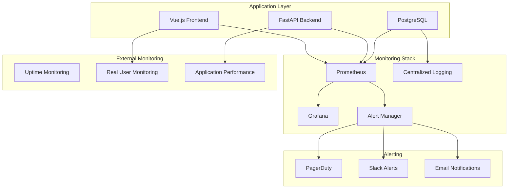

# Site Reliability Engineering (SRE)

## SRE Overview

Site Reliability Engineering for Autrement Capable focuses on maintaining high availability, performance, and reliability for a platform serving neurodivergent users. Our SRE practices emphasize accessibility, user experience continuity, and proactive monitoring.

## Service Level Objectives (SLOs)

### Availability SLOs

| Service | Target Availability | Error Budget | Measurement Window |
|---------|-------------------|--------------|-------------------|
| **Frontend Web App** | 99.9% (8.77h/month) | 0.1% | 30 days |
| **Backend API** | 99.95% (2.19h/month) | 0.05% | 30 days |
| **Database** | 99.99% (0.44h/month) | 0.01% | 30 days |
| **Authentication** | 99.99% (0.44h/month) | 0.01% | 30 days |

### Performance SLOs

| Metric | Target | Measurement |
|--------|--------|-------------|
| **Page Load Time** | < 2 seconds (95th percentile) | Real User Monitoring |
| **API Response Time** | < 500ms (95th percentile) | Server-side monitoring |
| **Game Loading** | < 5 seconds (95th percentile) | Client-side tracking |
| **Database Queries** | < 100ms (95th percentile) | Query performance logs |

### User Experience SLOs

| Metric | Target | Notes |
|--------|--------|-------|
| **Accessibility Score** | > 95% WCAG 2.1 AA | Automated testing |
| **Error Rate** | < 0.1% | User-facing errors |
| **Session Success Rate** | > 99% | Complete user flows |
| **Data Loss** | 0% | User progress and profiles |

## Monitoring and Observability

### Monitoring Architecture



### Key Metrics

#### Infrastructure Metrics
```python
# Prometheus metrics configuration
INFRASTRUCTURE_METRICS = {
    'cpu_usage': {
        'name': 'system_cpu_usage_percent',
        'type': 'gauge',
        'threshold': 80,
        'critical': 90
    },
    'memory_usage': {
        'name': 'system_memory_usage_percent',
        'type': 'gauge',
        'threshold': 80,
        'critical': 90
    },
    'disk_usage': {
        'name': 'system_disk_usage_percent',
        'type': 'gauge',
        'threshold': 85,
        'critical': 95
    },
    'network_latency': {
        'name': 'network_latency_ms',
        'type': 'histogram',
        'threshold': 100,
        'critical': 500
    }
}
```

#### Application Metrics
```python
# Custom application metrics
APPLICATION_METRICS = {
    'user_sessions': {
        'name': 'active_user_sessions_total',
        'type': 'gauge',
        'help': 'Number of active user sessions'
    },
    'game_completions': {
        'name': 'game_completions_total',
        'type': 'counter',
        'help': 'Total number of completed games'
    },
    'api_requests': {
        'name': 'api_requests_total',
        'type': 'counter',
        'labels': ['method', 'endpoint', 'status'],
        'help': 'Total API requests'
    },
    'database_connections': {
        'name': 'database_connections_active',
        'type': 'gauge',
        'help': 'Active database connections'
    },
    'auth_failures': {
        'name': 'authentication_failures_total',
        'type': 'counter',
        'help': 'Failed authentication attempts'
    }
}
```

#### Business Metrics
```python
# User experience and business metrics
BUSINESS_METRICS = {
    'user_registrations': {
        'name': 'user_registrations_daily',
        'type': 'gauge',
        'help': 'Daily user registrations'
    },
    'profile_completions': {
        'name': 'profile_completion_rate',
        'type': 'gauge',
        'help': 'Percentage of completed user profiles'
    },
    'accessibility_usage': {
        'name': 'accessibility_widget_usage',
        'type': 'counter',
        'help': 'Accessibility feature usage'
    },
    'user_retention': {
        'name': 'user_retention_rate',
        'type': 'gauge',
        'help': 'User retention rates'
    }
}
```

### Logging Strategy

#### Structured Logging Format
```python
# Logging configuration
import structlog
import logging

# Configure structured logging
structlog.configure(
    processors=[
        structlog.stdlib.filter_by_level,
        structlog.stdlib.add_logger_name,
        structlog.stdlib.add_log_level,
        structlog.stdlib.PositionalArgumentsFormatter(),
        structlog.processors.StackInfoRenderer(),
        structlog.processors.format_exc_info,
        structlog.processors.UnicodeDecoder(),
        structlog.processors.JSONRenderer()
    ],
    context_class=dict,
    logger_factory=structlog.stdlib.LoggerFactory(),
    wrapper_class=structlog.stdlib.BoundLogger,
    cache_logger_on_first_use=True,
)

# Example log entry
logger = structlog.get_logger()
logger.info(
    "User completed game",
    user_id=12345,
    game_type="scenario",
    completion_time=120.5,
    score=85,
    session_id="abc123",
    timestamp="2024-01-15T10:30:00Z"
)
```

#### Log Levels and Categories
```python
LOG_CATEGORIES = {
    'security': {
        'level': 'WARNING',
        'examples': ['failed_login', 'suspicious_activity', 'rate_limit_exceeded']
    },
    'user_activity': {
        'level': 'INFO',
        'examples': ['game_started', 'profile_updated', 'badge_earned']
    },
    'system_performance': {
        'level': 'DEBUG',
        'examples': ['slow_query', 'high_cpu', 'memory_warning']
    },
    'business_events': {
        'level': 'INFO',
        'examples': ['user_registered', 'goal_achieved', 'feature_used']
    },
    'errors': {
        'level': 'ERROR',
        'examples': ['api_error', 'database_error', 'external_service_failure']
    }
}
```

## Alerting and Incident Response

### Alert Configuration

#### Critical Alerts (Immediate Response)
```yaml
# alerts.yml - Critical alerts
groups:
  - name: critical
    rules:
      - alert: ServiceDown
        expr: up == 0
        for: 1m
        labels:
          severity: critical
        annotations:
          summary: "Service {{ $labels.instance }} is down"
          description: "Service has been down for more than 1 minute"

      - alert: HighErrorRate
        expr: rate(http_requests_total{status=~"5.."}[5m]) > 0.1
        for: 2m
        labels:
          severity: critical
        annotations:
          summary: "High error rate detected"
          description: "Error rate is {{ $value }} req/sec"

      - alert: DatabaseDown
        expr: postgresql_up == 0
        for: 30s
        labels:
          severity: critical
        annotations:
          summary: "PostgreSQL database is down"
          description: "Database connection failed"

      - alert: AuthenticationFailure
        expr: rate(authentication_failures_total[5m]) > 10
        for: 2m
        labels:
          severity: critical
        annotations:
          summary: "High authentication failure rate"
          description: "Potential security incident"
```

#### Warning Alerts (Proactive Monitoring)
```yaml
  - name: warning
    rules:
      - alert: HighCPUUsage
        expr: system_cpu_usage_percent > 80
        for: 5m
        labels:
          severity: warning
        annotations:
          summary: "High CPU usage on {{ $labels.instance }}"
          description: "CPU usage is {{ $value }}%"

      - alert: HighMemoryUsage
        expr: system_memory_usage_percent > 80
        for: 5m
        labels:
          severity: warning
        annotations:
          summary: "High memory usage on {{ $labels.instance }}"
          description: "Memory usage is {{ $value }}%"

      - alert: SlowAPIResponse
        expr: histogram_quantile(0.95, rate(http_request_duration_seconds_bucket[5m])) > 1
        for: 3m
        labels:
          severity: warning
        annotations:
          summary: "Slow API responses detected"
          description: "95th percentile response time is {{ $value }}s"
```

### Incident Response Playbooks

#### Service Outage Response
```markdown
## Service Outage Incident Response

### Immediate Actions (0-5 minutes)
1. **Acknowledge Alert**: Confirm receipt and take ownership
2. **Initial Assessment**: 
   - Check service status dashboard
   - Verify if partial or complete outage
   - Check recent deployments
3. **Communication**:
   - Post in #incidents Slack channel
   - Update status page if public-facing
4. **Initial Triage**:
   - Check infrastructure metrics
   - Review recent logs
   - Verify external dependencies

### Investigation Phase (5-30 minutes)
1. **Root Cause Analysis**:
   - Check application logs
   - Review infrastructure metrics
   - Verify database connectivity
   - Check external service status
2. **Escalation if needed**:
   - Senior SRE if infrastructure issue
   - Development team if application issue
   - Security team if potential security incident

### Resolution Phase
1. **Apply Fix**:
   - Rollback recent deployment (if applicable)
   - Restart services (if appropriate)
   - Scale resources (if capacity issue)
2. **Verify Resolution**:
   - Confirm services are healthy
   - Test critical user flows
   - Monitor metrics for stability
3. **Communication**:
   - Update stakeholders
   - Update status page
   - Document timeline

### Post-Incident
1. **Monitor**: Continue monitoring for 1 hour post-resolution
2. **Document**: Create incident report
3. **Schedule**: Post-mortem meeting within 48 hours
```

#### Performance Degradation Response
```markdown
## Performance Degradation Incident Response

### Initial Assessment
1. **Quantify Impact**:
   - How many users affected?
   - Which services/features impacted?
   - Severity of performance degradation
2. **Check Recent Changes**:
   - Recent deployments
   - Configuration changes
   - Infrastructure modifications

### Investigation Steps
1. **Application Performance**:
   - Check API response times
   - Review database query performance
   - Analyze frontend load times
2. **Infrastructure Health**:
   - CPU, memory, disk usage
   - Network latency
   - Load balancer status
3. **External Dependencies**:
   - Third-party service status
   - CDN performance
   - DNS resolution

### Mitigation Actions
1. **Immediate Relief**:
   - Scale up resources if needed
   - Enable caching if appropriate
   - Redirect traffic if possible
2. **Optimize Performance**:
   - Identify and optimize slow queries
   - Implement temporary rate limiting
   - Cache frequently accessed data
```

## Capacity Planning

### Capacity Metrics

#### User Growth Projections
```python
# Capacity planning model
CAPACITY_PROJECTIONS = {
    'current_users': 1000,
    'monthly_growth_rate': 0.15,  # 15% monthly growth
    'peak_usage_multiplier': 2.5,  # Peak usage vs average
    'projected_timeframe': 12,     # months
    'resource_planning': {
        'cpu_per_100_users': 2,    # vCPUs
        'memory_per_100_users': 4,  # GB RAM
        'storage_per_100_users': 10, # GB storage
        'bandwidth_per_100_users': 1 # Mbps
    }
}

def calculate_capacity_requirements(months_ahead):
    """Calculate infrastructure capacity requirements"""
    future_users = CAPACITY_PROJECTIONS['current_users'] * (
        (1 + CAPACITY_PROJECTIONS['monthly_growth_rate']) ** months_ahead
    )
    
    peak_users = future_users * CAPACITY_PROJECTIONS['peak_usage_multiplier']
    
    return {
        'expected_users': future_users,
        'peak_users': peak_users,
        'cpu_required': (peak_users / 100) * CAPACITY_PROJECTIONS['resource_planning']['cpu_per_100_users'],
        'memory_required': (peak_users / 100) * CAPACITY_PROJECTIONS['resource_planning']['memory_per_100_users'],
        'storage_required': (peak_users / 100) * CAPACITY_PROJECTIONS['resource_planning']['storage_per_100_users'],
        'bandwidth_required': (peak_users / 100) * CAPACITY_PROJECTIONS['resource_planning']['bandwidth_per_100_users']
    }
```

#### Database Growth Planning
```python
# Database capacity planning
DATABASE_CAPACITY = {
    'current_size_gb': 50,
    'monthly_growth_gb': 10,
    'user_data_per_user_mb': 5,  # Average user profile + game data
    'log_retention_days': 90,
    'backup_retention_days': 30,
    'index_overhead_percentage': 20
}

def calculate_database_capacity(months_ahead, projected_users):
    """Calculate database capacity requirements"""
    user_data_size = (projected_users * DATABASE_CAPACITY['user_data_per_user_mb']) / 1024  # GB
    growth_size = DATABASE_CAPACITY['monthly_growth_gb'] * months_ahead
    index_overhead = (user_data_size + growth_size) * (DATABASE_CAPACITY['index_overhead_percentage'] / 100)
    
    return {
        'total_size_gb': user_data_size + growth_size + index_overhead,
        'backup_size_gb': (user_data_size + growth_size) * 1.5,  # Including compression
        'recommended_size_gb': (user_data_size + growth_size + index_overhead) * 1.3  # 30% buffer
    }
```

### Auto-scaling Configuration

#### Kubernetes HPA (Horizontal Pod Autoscaler)
```yaml
# hpa-backend.yml
apiVersion: autoscaling/v2
kind: HorizontalPodAutoscaler
metadata:
  name: backend-hpa
spec:
  scaleTargetRef:
    apiVersion: apps/v1
    kind: Deployment
    name: backend-deployment
  minReplicas: 2
  maxReplicas: 20
  metrics:
  - type: Resource
    resource:
      name: cpu
      target:
        type: Utilization
        averageUtilization: 70
  - type: Resource
    resource:
      name: memory
      target:
        type: Utilization
        averageUtilization: 80
  behavior:
    scaleUp:
      stabilizationWindowSeconds: 60
      policies:
      - type: Percent
        value: 100
        periodSeconds: 15
    scaleDown:
      stabilizationWindowSeconds: 300
      policies:
      - type: Percent
        value: 10
        periodSeconds: 60
```

#### Docker Swarm Auto-scaling
```yaml
# docker-compose.scale.yml
version: '3.8'
services:
  backend:
    deploy:
      replicas: 3
      update_config:
        parallelism: 1
        delay: 10s
        order: start-first
        failure_action: rollback
      restart_policy:
        condition: on-failure
        delay: 5s
        max_attempts: 3
      resources:
        limits:
          cpus: '1.0'
          memory: 1G
        reservations:
          cpus: '0.5'
          memory: 512M
```

## Backup and Disaster Recovery

### Backup Strategy

#### Database Backup Configuration
```bash
#!/bin/bash
# backup-database.sh

set -e

BACKUP_DIR="/backups/database"
DATE=$(date +%Y%m%d_%H%M%S)
RETENTION_DAYS=30

# Create backup directory
mkdir -p $BACKUP_DIR

# Database backup
echo "Starting database backup..."
docker-compose exec -T db pg_dump \
    -U $POSTGRES_USER \
    -h localhost \
    -p 5432 \
    --no-password \
    --format=custom \
    --compress=9 \
    --verbose \
    $POSTGRES_DB > $BACKUP_DIR/database_$DATE.dump

# Create SQL backup for easier restoration
docker-compose exec -T db pg_dump \
    -U $POSTGRES_USER \
    -h localhost \
    -p 5432 \
    --no-password \
    --format=plain \
    --inserts \
    $POSTGRES_DB > $BACKUP_DIR/database_$DATE.sql

# Compress SQL backup
gzip $BACKUP_DIR/database_$DATE.sql

# Upload to cloud storage (example: AWS S3)
if [ ! -z "$AWS_S3_BACKUP_BUCKET" ]; then
    aws s3 cp $BACKUP_DIR/database_$DATE.dump s3://$AWS_S3_BACKUP_BUCKET/database/
    aws s3 cp $BACKUP_DIR/database_$DATE.sql.gz s3://$AWS_S3_BACKUP_BUCKET/database/
fi

# Clean up old backups
find $BACKUP_DIR -name "database_*.dump" -mtime +$RETENTION_DAYS -delete
find $BACKUP_DIR -name "database_*.sql.gz" -mtime +$RETENTION_DAYS -delete

echo "Database backup completed: $BACKUP_DIR/database_$DATE.dump"
```

#### Application Data Backup
```bash
#!/bin/bash
# backup-application.sh

set -e

BACKUP_DIR="/backups/application"
DATE=$(date +%Y%m%d_%H%M%S)

# User uploaded files
echo "Backing up user files..."
tar -czf $BACKUP_DIR/user_files_$DATE.tar.gz /app/uploads/

# Configuration files
echo "Backing up configuration..."
tar -czf $BACKUP_DIR/config_$DATE.tar.gz \
    /app/.env \
    /app/config/ \
    /etc/nginx/nginx.conf

# Application logs (last 7 days)
echo "Backing up recent logs..."
find /app/logs -name "*.log" -mtime -7 -exec tar -czf $BACKUP_DIR/logs_$DATE.tar.gz {} +

echo "Application backup completed"
```

### Disaster Recovery Plan

#### Recovery Time Objectives (RTO)
| Component | Target RTO | Description |
|-----------|------------|-------------|
| **Database** | 15 minutes | Restore from latest backup |
| **Application** | 30 minutes | Redeploy from Git + restore data |
| **Full System** | 1 hour | Complete infrastructure rebuild |
| **User Data** | 5 minutes | Access to user profiles and progress |

#### Recovery Point Objectives (RPO)
| Data Type | Target RPO | Backup Frequency |
|-----------|------------|------------------|
| **User Profiles** | 1 hour | Continuous replication |
| **Game Progress** | 15 minutes | Real-time sync |
| **System Logs** | 24 hours | Daily backup |
| **Configuration** | 1 hour | Version control + backup |

#### Disaster Recovery Procedures
```markdown
## Complete System Recovery

### Prerequisites
- Access to backup storage
- DNS management access
- Cloud infrastructure access
- SSL certificates

### Recovery Steps

1. **Infrastructure Setup** (Target: 15 minutes)
   ```bash
   # Provision new infrastructure
   terraform apply -var="environment=disaster-recovery"
   
   # Verify resources
   terraform output
   ```

2. **Database Recovery** (Target: 15 minutes)
   ```bash
   # Restore latest database backup
   pg_restore -U postgres -d autrement_capable_prod \
       --clean --if-exists --verbose \
       /backups/database_latest.dump
   
   # Verify data integrity
   psql -U postgres -d autrement_capable_prod \
       -c "SELECT COUNT(*) FROM users;"
   ```

3. **Application Deployment** (Target: 20 minutes)
   ```bash
   # Deploy latest stable version
   git checkout tags/v1.0.0
   docker-compose -f docker-compose.prod.yml up -d
   
   # Verify services
   curl https://new-domain.com/health
   ```

4. **DNS Cutover** (Target: 5 minutes)
   ```bash
   # Update DNS records
   aws route53 change-resource-record-sets \
       --hosted-zone-id Z123456789 \
       --change-batch file://dns-change.json
   ```

5. **Verification** (Target: 5 minutes)
   - [ ] All services responding
   - [ ] User authentication working
   - [ ] Game data accessible
   - [ ] SSL certificates valid
   - [ ] Monitoring active
```

## Performance Optimization

### Database Performance

#### Query Optimization
```sql
-- Index recommendations for common queries
CREATE INDEX CONCURRENTLY idx_users_active_login 
ON users (is_active, last_login) 
WHERE is_active = true;

CREATE INDEX CONCURRENTLY idx_game_data_user_completion 
ON scenario_game_data (user_id, completion) 
WHERE completion > 0;

CREATE INDEX CONCURRENTLY idx_user_sessions_active 
ON user_sessions (user_id, created_at) 
WHERE expires_at > NOW();

-- Analyze query performance
EXPLAIN (ANALYZE, BUFFERS) 
SELECT u.username, sgd.completion 
FROM users u 
JOIN scenario_game_data sgd ON u.id = sgd.user_id 
WHERE u.is_active = true 
AND sgd.completion > 0.5;
```

#### Connection Pool Optimization
```python
# Database connection pool configuration
DATABASE_CONFIG = {
    'pool_size': 20,           # Base number of connections
    'max_overflow': 50,        # Additional connections under load
    'pool_timeout': 30,        # Timeout waiting for connection
    'pool_recycle': 3600,      # Recycle connections after 1 hour
    'pool_pre_ping': True,     # Validate connections before use
    'echo': False,             # Disable SQL query logging in production
    'isolation_level': 'READ_COMMITTED'
}
```

### Application Performance

#### Caching Strategy
```python
# Redis caching configuration
import redis
from functools import wraps

redis_client = redis.Redis(
    host='localhost',
    port=6379,
    db=0,
    decode_responses=True,
    health_check_interval=30
)

def cache_result(expiration=300):
    """Cache function results in Redis"""
    def decorator(func):
        @wraps(func)
        async def wrapper(*args, **kwargs):
            # Create cache key
            cache_key = f"{func.__name__}:{hash(str(args) + str(kwargs))}"
            
            # Try to get from cache
            cached_result = redis_client.get(cache_key)
            if cached_result:
                return json.loads(cached_result)
            
            # Execute function and cache result
            result = await func(*args, **kwargs)
            redis_client.setex(
                cache_key, 
                expiration, 
                json.dumps(result, default=str)
            )
            
            return result
        return wrapper
    return decorator

# Example usage
@cache_result(expiration=600)  # Cache for 10 minutes
async def get_user_game_summary(user_id: int):
    """Get cached user game summary"""
    # Database query here
    pass
```

### Frontend Performance

#### Performance Monitoring
```javascript
// Frontend performance monitoring
class PerformanceMonitor {
    constructor() {
        this.metrics = {
            pageLoad: [],
            apiCalls: [],
            gameLoading: []
        };
    }
    
    trackPageLoad() {
        window.addEventListener('load', () => {
            const loadTime = performance.timing.loadEventEnd - performance.timing.navigationStart;
            this.metrics.pageLoad.push(loadTime);
            
            // Send to monitoring service
            this.sendMetric('page_load_time', loadTime);
        });
    }
    
    trackApiCall(endpoint, duration) {
        this.metrics.apiCalls.push({ endpoint, duration });
        
        if (duration > 1000) {  // Slow API call
            this.sendMetric('slow_api_call', { endpoint, duration });
        }
    }
    
    sendMetric(type, data) {
        // Send to monitoring endpoint
        fetch('/api/metrics', {
            method: 'POST',
            headers: { 'Content-Type': 'application/json' },
            body: JSON.stringify({ type, data, timestamp: Date.now() })
        });
    }
}

// Initialize performance monitoring
const monitor = new PerformanceMonitor();
monitor.trackPageLoad();
```

## Security and Compliance

### Security Monitoring

#### Security Metrics
```python
SECURITY_METRICS = {
    'failed_logins': {
        'threshold': 10,  # per 5 minutes
        'action': 'rate_limit_ip'
    },
    'suspicious_activity': {
        'threshold': 5,   # unusual patterns
        'action': 'flag_for_review'
    },
    'data_access_anomalies': {
        'threshold': 3,   # unusual data access patterns
        'action': 'security_alert'
    }
}
```

#### Compliance Monitoring
```python
# GDPR compliance checks
COMPLIANCE_CHECKS = {
    'data_retention': {
        'check': 'verify_data_retention_policy',
        'frequency': 'daily',
        'description': 'Ensure data is deleted per retention policy'
    },
    'consent_tracking': {
        'check': 'verify_user_consent_records',
        'frequency': 'weekly',
        'description': 'Verify all user actions have proper consent'
    },
    'data_export': {
        'check': 'test_user_data_export',
        'frequency': 'monthly',
        'description': 'Test user data export functionality'
    }
}
```

## Continuous Improvement

### SRE Metrics Dashboard

#### Key Performance Indicators
```python
SRE_KPIS = {
    'availability': {
        'current': 99.97,
        'target': 99.95,
        'trend': 'stable'
    },
    'latency': {
        'p95_ms': 450,
        'target_ms': 500,
        'trend': 'improving'
    },
    'error_rate': {
        'current': 0.05,
        'target': 0.1,
        'trend': 'stable'
    },
    'mttr_minutes': {
        'current': 12,
        'target': 15,
        'trend': 'improving'
    }
}
```

### Post-Mortem Process

#### Incident Review Template
```markdown
# Post-Mortem: [Incident Title]

## Incident Summary
- **Date**: YYYY-MM-DD
- **Duration**: X hours Y minutes
- **Severity**: [Critical/High/Medium/Low]
- **Root Cause**: Brief description

## Timeline
| Time | Event |
|------|-------|
| HH:MM | Initial alert triggered |
| HH:MM | Incident response team engaged |
| HH:MM | Root cause identified |
| HH:MM | Fix deployed |
| HH:MM | Resolution confirmed |

## Impact Assessment
- **Users Affected**: X users (Y% of total)
- **Services Impacted**: List of affected services
- **Revenue Impact**: $X (if applicable)
- **User Experience Impact**: Description

## Root Cause Analysis
### What Happened
- Detailed technical explanation

### Why It Happened
- Contributing factors
- Systemic issues

### Why It Wasn't Caught Earlier
- Monitoring gaps
- Process failures

## Action Items
| Action | Owner | Due Date | Status |
|--------|-------|----------|--------|
| Improve monitoring for X | SRE Team | YYYY-MM-DD | Open |
| Update runbook for Y | Dev Team | YYYY-MM-DD | Open |
| Add automated test for Z | QA Team | YYYY-MM-DD | Open |

## Lessons Learned
- What went well
- What could be improved
- Systemic improvements needed
```

---

*This SRE documentation ensures the Autrement Capable platform maintains high reliability, performance, and security standards while serving its critical mission of supporting neurodivergent youth.*