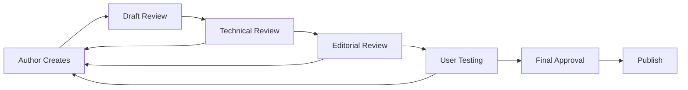

# Documentation Maintenance Guide

## Purpose and Scope

This internal guide outlines how to continuously maintain, update, and improve the documentation for the Autrement Capable project. It includes both manual processes and AI-assisted documentation strategies to ensure our documentation remains current, accurate, and valuable.

## Documentation Philosophy

### Core Principles
- **Documentation as Code**: All documentation is version-controlled and reviewed like code
- **User-Centered**: Documentation serves real user needs (developers, operators, stakeholders)
- **Living Documentation**: Documents evolve with the codebase and are never "done"
- **Accessibility First**: Documentation itself must be accessible and inclusive
- **Evidence-Based**: Regular metrics and feedback drive documentation decisions

### Quality Standards
- **Accuracy**: Information must be current and correct
- **Completeness**: Cover all necessary topics for target audience
- **Clarity**: Written in clear, accessible language
- **Consistency**: Uniform structure, tone, and formatting
- **Maintainability**: Easy to update and extend

## Documentation Lifecycle

### 1. Planning Phase

#### Documentation Needs Assessment
```markdown
# Documentation Assessment Template

## New Feature/Change
- **What**: Brief description of change
- **Impact**: Who/what is affected
- **Documentation Needed**: 
  - [ ] API documentation
  - [ ] User guide updates
  - [ ] Developer setup changes
  - [ ] Architecture updates
  - [ ] Deployment process changes

## Target Audience
- [ ] New developers
- [ ] Existing team members
- [ ] System administrators
- [ ] End users
- [ ] Stakeholders

## Success Criteria
- How will we know this documentation is successful?
- What metrics will we track?
```

#### Documentation Planning Checklist
```markdown
## Pre-Development Planning
- [ ] Identify documentation requirements in feature planning
- [ ] Assign documentation responsibility (author + reviewer)
- [ ] Estimate documentation effort (usually 20-30% of development time)
- [ ] Plan documentation timeline alongside development

## During Development
- [ ] Update documentation as code changes
- [ ] Include documentation in code review process
- [ ] Test documentation accuracy with real scenarios
- [ ] Gather feedback from intended audience

## Post-Development
- [ ] Final documentation review and approval
- [ ] Update related documentation (cross-references)
- [ ] Communicate changes to relevant teams
- [ ] Schedule follow-up review in 3-6 months
```

### 2. Creation and Authoring

#### Documentation Templates

##### New Feature Documentation Template
```markdown
# [Feature Name]

## Overview
Brief description of the feature and its purpose.

## User Impact
- Who benefits from this feature?
- How does it improve the user experience?
- Any accessibility considerations?

## Technical Implementation
- Architecture overview
- Key components involved
- Integration points

## Setup and Configuration
Step-by-step instructions for:
- Development environment
- Testing
- Deployment

## API Changes (if applicable)
- New endpoints
- Modified endpoints
- Breaking changes
- Migration guide

## Testing
- How to test this feature
- Automated test coverage
- Manual testing scenarios

## Troubleshooting
Common issues and solutions.

## Related Documentation
Links to related docs that should be updated.
```

##### API Documentation Template
```markdown
# API Endpoint: [Method] [Path]

## Description
What this endpoint does and when to use it.

## Authentication
Required authentication and permissions.

## Request
### Headers
```http
Content-Type: application/json
Authorization: Bearer {token}
```

### Parameters
| Parameter | Type | Required | Description |
|-----------|------|----------|-------------|
| `param1` | string | Yes | Description |

### Request Body
```json
{
  "example": "request body"
}
```

## Response
### Success Response (200)
```json
{
  "success": true,
  "data": {
    "example": "response"
  }
}
```

### Error Responses
| Status | Description | Response Body |
|--------|-------------|---------------|
| 400 | Bad Request | `{"error": "description"}` |
| 401 | Unauthorized | `{"error": "authentication required"}` |

## Examples
### cURL
```bash
curl -X POST https://api.autrement-cap.fr/endpoint \
  -H "Authorization: Bearer token" \
  -H "Content-Type: application/json" \
  -d '{"example": "data"}'
```

### JavaScript
```javascript
const response = await fetch('/api/endpoint', {
  method: 'POST',
  headers: {
    'Authorization': `Bearer ${token}`,
    'Content-Type': 'application/json'
  },
  body: JSON.stringify({ example: 'data' })
});
```

## Notes
Any additional important information.
```

#### Writing Guidelines

##### Style Guide
```markdown
## Language and Tone
- **Clear and Concise**: Use simple, direct language
- **Active Voice**: "Click the button" not "The button should be clicked"
- **Present Tense**: "The system processes requests" not "The system will process"
- **Inclusive Language**: Avoid assumptions about user abilities or technical knowledge

## Structure
- **Headings**: Use descriptive headings that work with screen readers
- **Lists**: Use bullet points for unordered items, numbers for sequences
- **Code Blocks**: Always specify the language for syntax highlighting
- **Tables**: Include headers and keep them simple

## Technical Writing
- **Define Terms**: Include glossary for technical terms
- **Provide Context**: Explain the "why" not just the "how"
- **Include Examples**: Real, working examples that can be copy-pasted
- **Error Scenarios**: Document what can go wrong and how to fix it
```

##### Accessibility in Documentation
```markdown
## Accessible Documentation Checklist
- [ ] Headings follow proper hierarchy (H1 > H2 > H3)
- [ ] Links have descriptive text (not "click here")
- [ ] Images include alt text
- [ ] Tables have proper headers
- [ ] Code examples are properly formatted
- [ ] Color is not the only way to convey information
- [ ] Text contrast meets WCAG guidelines
- [ ] Content is readable by screen readers
```

### 3. Review and Approval Process

#### Documentation Review Checklist
```markdown
## Technical Review
- [ ] Information is accurate and current
- [ ] Code examples work as written
- [ ] Links are functional and point to correct resources
- [ ] Instructions can be followed by target audience
- [ ] All edge cases and error scenarios covered

## Editorial Review
- [ ] Grammar and spelling are correct
- [ ] Tone is consistent with style guide
- [ ] Structure is logical and easy to follow
- [ ] Accessibility guidelines followed
- [ ] Cross-references are appropriate and helpful

## User Testing
- [ ] Document tested with actual users from target audience
- [ ] Feedback incorporated from testing
- [ ] Common questions and confusion points addressed
- [ ] Success criteria met
```

#### Review Process


### 4. Maintenance and Updates

#### Regular Maintenance Schedule

##### Weekly Tasks
```markdown
## Weekly Documentation Maintenance
- [ ] Review documentation metrics and user feedback
- [ ] Check for broken links (automated + manual spot check)
- [ ] Update any time-sensitive information
- [ ] Review recent code changes for documentation impact
- [ ] Address urgent documentation issues from support tickets
```

##### Monthly Tasks
```markdown
## Monthly Documentation Review
- [ ] Comprehensive link checking across all documentation
- [ ] Review documentation analytics and user journeys
- [ ] Update screenshots and UI-related documentation
- [ ] Audit documentation against current codebase
- [ ] Review and update getting started guides
- [ ] Check for outdated version references
```

##### Quarterly Tasks
```markdown
## Quarterly Documentation Audit
- [ ] Full documentation architecture review
- [ ] User feedback analysis and prioritization
- [ ] Documentation gap analysis
- [ ] Performance and accessibility audit
- [ ] Style guide updates and enforcement
- [ ] Documentation tool and process evaluation
```

#### Documentation Metrics and Analytics

##### Key Performance Indicators
```python
# Documentation KPIs
DOCUMENTATION_METRICS = {
    'usage_metrics': {
        'page_views': 'Track which docs are most/least used',
        'time_on_page': 'Indicates content quality and completeness',
        'bounce_rate': 'Users leaving without finding what they need',
        'search_queries': 'What users are looking for'
    },
    'quality_metrics': {
        'user_feedback_score': 'Direct user satisfaction ratings',
        'support_ticket_reduction': 'Documentation effectiveness',
        'broken_links': 'Technical quality measure',
        'accessibility_score': 'Inclusivity measure'
    },
    'maintenance_metrics': {
        'documentation_coverage': 'Percentage of features documented',
        'staleness_index': 'How outdated documentation is',
        'review_frequency': 'How often docs are updated',
        'contributor_count': 'Community engagement'
    }
}
```

##### Analytics Dashboard
```markdown
## Documentation Dashboard (Monthly Report)

### Usage Statistics
- **Total Page Views**: 10,245 (+15% from last month)
- **Unique Visitors**: 2,156 (+8% from last month)
- **Most Popular Pages**:
  1. Developer Getting Started (2,345 views)
  2. Local Development Setup (1,892 views)
  3. API Documentation (1,567 views)

### Quality Indicators
- **Average User Rating**: 4.2/5 (target: >4.0)
- **Documentation-Related Support Tickets**: 12 (-25% from last month)
- **Broken Links**: 3 (target: <5)
- **Accessibility Score**: 96% (target: >95%)

### Maintenance Health
- **Documentation Coverage**: 85% (target: >80%)
- **Average Page Age**: 45 days (target: <60 days)
- **Pages Needing Review**: 8 (target: <10)
```

## AI-Assisted Documentation

### AI Tools Integration

#### Automated Documentation Generation
```python
# AI-assisted documentation generation
class DocumentationAI:
    def __init__(self):
        self.openai_client = OpenAI(api_key=os.getenv("OPENAI_API_KEY"))
    
    async def generate_api_docs(self, endpoint_code: str) -> str:
        """Generate API documentation from code"""
        prompt = f"""
        Generate comprehensive API documentation for this FastAPI endpoint:
        
        {endpoint_code}
        
        Include:
        - Description and purpose
        - Request/response examples
        - Error scenarios
        - Authentication requirements
        - Parameter descriptions
        
        Format as Markdown following our style guide.
        """
        
        response = await self.openai_client.chat.completions.create(
            model="gpt-4",
            messages=[{"role": "user", "content": prompt}],
            temperature=0.3
        )
        
        return response.choices[0].message.content
    
    async def suggest_documentation_improvements(self, content: str) -> List[str]:
        """Analyze documentation and suggest improvements"""
        prompt = f"""
        Review this documentation content and suggest improvements:
        
        {content}
        
        Focus on:
        - Clarity and readability
        - Completeness
        - Accessibility
        - User experience
        - Technical accuracy
        
        Provide specific, actionable suggestions.
        """
        
        response = await self.openai_client.chat.completions.create(
            model="gpt-4",
            messages=[{"role": "user", "content": prompt}],
            temperature=0.5
        )
        
        return response.choices[0].message.content.split('\n')
```

#### Documentation Quality Checks
```python
# Automated documentation quality checks
class DocumentationQualityChecker:
    def __init__(self):
        self.checks = {
            'readability': self.check_readability,
            'completeness': self.check_completeness,
            'accessibility': self.check_accessibility,
            'freshness': self.check_freshness,
            'accuracy': self.check_accuracy
        }
    
    def check_readability(self, content: str) -> Dict[str, Any]:
        """Check content readability using various metrics"""
        # Flesch Reading Ease, sentence length, etc.
        pass
    
    def check_completeness(self, content: str) -> Dict[str, Any]:
        """Check if documentation covers all necessary topics"""
        # Check for required sections, examples, etc.
        pass
    
    def check_accessibility(self, markdown: str) -> Dict[str, Any]:
        """Check accessibility of documentation"""
        issues = []
        
        # Check heading hierarchy
        headings = re.findall(r'^#+\s+(.+)$', markdown, re.MULTILINE)
        # Validate heading structure
        
        # Check for alt text in images
        images = re.findall(r'!\[([^\]]*)\]', markdown)
        for alt_text in images:
            if not alt_text.strip():
                issues.append("Image missing alt text")
        
        # Check link descriptions
        links = re.findall(r'\[([^\]]+)\]', markdown)
        for link_text in links:
            if link_text.lower() in ['here', 'click here', 'this']:
                issues.append(f"Non-descriptive link text: '{link_text}'")
        
        return {
            'score': max(0, 100 - len(issues) * 10),
            'issues': issues
        }
```

### AI-Powered Documentation Workflows

#### Automated Documentation Updates
```yaml
# .github/workflows/docs-ai-update.yml
name: AI Documentation Updates

on:
  pull_request:
    paths: ['Backend/app/api/**/*.py']

jobs:
  update-docs:
    runs-on: ubuntu-latest
    steps:
    - uses: actions/checkout@v3
    
    - name: Detect API Changes
      id: api-changes
      run: |
        git diff --name-only HEAD~1 HEAD | grep "Backend/app/api" > changed_files.txt || true
        echo "changed_files=$(cat changed_files.txt)" >> $GITHUB_OUTPUT
    
    - name: Generate Documentation Updates
      if: steps.api-changes.outputs.changed_files != ''
      env:
        OPENAI_API_KEY: ${{ secrets.OPENAI_API_KEY }}
      run: |
        python scripts/ai-doc-generator.py \
          --files "${{ steps.api-changes.outputs.changed_files }}" \
          --output docs/api-updates.md
    
    - name: Create Documentation PR
      if: steps.api-changes.outputs.changed_files != ''
      uses: peter-evans/create-pull-request@v5
      with:
        title: "AI-Generated Documentation Updates"
        body: "Automated documentation updates based on API changes"
        branch: docs/ai-updates-${{ github.run_number }}
        commit-message: "Update documentation for API changes"
```

#### Documentation Quality Automation
```python
# scripts/doc-quality-check.py
#!/usr/bin/env python3

import asyncio
import os
from pathlib import Path
from typing import List, Dict

async def check_documentation_quality():
    """Run comprehensive documentation quality checks"""
    docs_dir = Path("docs")
    results = {}
    
    for doc_file in docs_dir.glob("*.md"):
        content = doc_file.read_text()
        
        # Run AI-powered quality analysis
        quality_score = await analyze_with_ai(content)
        
        # Run automated checks
        accessibility_score = check_accessibility(content)
        freshness_score = check_freshness(doc_file)
        
        results[doc_file.name] = {
            'quality_score': quality_score,
            'accessibility_score': accessibility_score,
            'freshness_score': freshness_score,
            'overall_score': (quality_score + accessibility_score + freshness_score) / 3
        }
    
    # Generate report
    generate_quality_report(results)
    
    # Create issues for low-scoring documentation
    for doc_name, scores in results.items():
        if scores['overall_score'] < 70:
            await create_improvement_issue(doc_name, scores)

if __name__ == "__main__":
    asyncio.run(check_documentation_quality())
```

## Documentation Governance

### Roles and Responsibilities

#### Documentation Team Structure
```markdown
## Documentation Roles

### Documentation Lead
- **Responsibilities**: Strategy, standards, and governance
- **Skills**: Technical writing, user experience, project management
- **Time Commitment**: 50% of role

### Technical Writers
- **Responsibilities**: Create and maintain technical documentation
- **Skills**: Technical writing, software development understanding
- **Time Commitment**: Full-time role

### Developer Contributors
- **Responsibilities**: Update docs with code changes, technical review
- **Skills**: Software development, domain expertise
- **Time Commitment**: 10-15% of development time

### Community Contributors
- **Responsibilities**: User feedback, accessibility testing, translation
- **Skills**: Domain knowledge, diverse perspectives
- **Time Commitment**: Volunteer basis
```

#### Decision-Making Process
```markdown
## Documentation Decision Framework

### Minor Changes (Examples, typos, clarifications)
- **Decision Maker**: Any team member
- **Process**: Direct commit or small PR
- **Review**: Post-commit review acceptable

### Medium Changes (New sections, restructuring)
- **Decision Maker**: Documentation Lead or Technical Writer
- **Process**: PR with technical review
- **Review**: Required before merge

### Major Changes (Architecture, standards, tooling)
- **Decision Maker**: Documentation Lead + Engineering Lead
- **Process**: RFC (Request for Comments) process
- **Review**: Team discussion and consensus
```

### Documentation Standards

#### Content Standards
```markdown
## Documentation Content Requirements

### Mandatory Elements
- [ ] Clear purpose statement
- [ ] Target audience identification
- [ ] Prerequisites and assumptions
- [ ] Step-by-step instructions (where applicable)
- [ ] Working examples
- [ ] Error handling and troubleshooting
- [ ] Related links and cross-references

### Quality Gates
- [ ] Technical accuracy verified
- [ ] Accessibility guidelines followed
- [ ] Style guide compliance
- [ ] User testing completed (for major docs)
- [ ] Review process completed
```

#### Tool and Technology Standards
```markdown
## Documentation Technology Stack

### Approved Tools
- **Authoring**: Markdown with specified extensions
- **Version Control**: Git (same repository as code)
- **Static Site Generator**: GitBook, Docusaurus, or similar
- **Diagramming**: Mermaid (text-based diagrams)
- **Screenshots**: Consistent style and update process
- **API Docs**: OpenAPI/Swagger integration

### Prohibited Practices
- Documentation in binary formats (Word, PDF)
- Screenshots without alt text
- External-only documentation (must be version controlled)
- Hardcoded URLs or configuration in examples
```

## Continuous Improvement Process

### Feedback Collection

#### User Feedback Mechanisms
```markdown
## Documentation Feedback Collection

### Embedded Feedback
- Rating widget on each documentation page
- "Was this helpful?" with comment option
- "Suggest improvements" link
- Quick feedback buttons (👍👎)

### Structured Feedback
- Monthly documentation survey
- User interviews for major documentation projects
- Usability testing sessions
- Analytics review meetings

### Community Feedback
- GitHub issues for documentation requests
- Discussion forums monitoring
- Support ticket analysis
- Conference and meetup feedback
```

#### Feedback Processing Workflow
```python
# Documentation feedback processing
class FeedbackProcessor:
    def __init__(self):
        self.feedback_sources = [
            'page_ratings',
            'user_surveys',
            'support_tickets',
            'github_issues'
        ]
    
    async def process_feedback(self):
        """Process and prioritize documentation feedback"""
        feedback_data = await self.collect_feedback()
        
        # Categorize feedback
        categories = {
            'accuracy_issues': [],
            'missing_content': [],
            'clarity_problems': [],
            'accessibility_issues': [],
            'feature_requests': []
        }
        
        for feedback in feedback_data:
            category = await self.categorize_feedback(feedback)
            categories[category].append(feedback)
        
        # Prioritize improvements
        priorities = await self.prioritize_improvements(categories)
        
        # Create action items
        await self.create_action_items(priorities)
        
        return priorities
```

### Documentation Evolution

#### Regular Review Cycles
```markdown
## Documentation Review Schedule

### Continuous (Real-time)
- Monitor user feedback and ratings
- Track support ticket trends
- Watch for code changes affecting documentation
- Respond to urgent accuracy issues

### Weekly
- Review weekly metrics and user feedback
- Identify trending issues or questions
- Update time-sensitive content
- Address quick fixes and improvements

### Monthly
- Comprehensive analytics review
- User journey analysis
- Documentation gap assessment
- Style guide and template updates

### Quarterly
- Strategic documentation planning
- Major structural reviews
- Tool and process evaluation
- User research and testing
- Documentation architecture assessment

### Annually
- Complete documentation audit
- Stakeholder interviews
- Competitive analysis
- Technology stack review
- Long-term roadmap planning
```

#### Innovation and Experimentation
```markdown
## Documentation Innovation Process

### Experimentation Framework
1. **Hypothesis**: What improvement do we want to test?
2. **Metrics**: How will we measure success?
3. **Experiment Design**: A/B test, user study, prototype
4. **Timeline**: Duration and review schedule
5. **Success Criteria**: When to adopt, iterate, or abandon

### Current Experiments
- AI-generated first drafts of API documentation
- Interactive tutorials for complex setup procedures
- Video supplements for visual learners
- Community-contributed translations
- Voice navigation for accessibility

### Innovation Ideas Pipeline
- Chatbot for documentation Q&A
- Automatically updated screenshots
- Code-to-documentation synchronization
- Personalized documentation paths
- Real-time collaboration features
```

## Success Measurement

### Documentation ROI

#### Quantitative Metrics
```python
# Documentation ROI calculation
DOCUMENTATION_ROI_METRICS = {
    'cost_metrics': {
        'creation_time_hours': 120,  # Average hours to create major doc
        'maintenance_time_monthly': 40,  # Hours per month to maintain
        'tool_costs_monthly': 200,  # Documentation tools and services
        'review_time_hours': 20  # Hours for review and approval
    },
    'benefit_metrics': {
        'support_ticket_reduction': 30,  # Tickets reduced per month
        'developer_onboarding_time_saved': 16,  # Hours saved per new developer
        'deployment_error_reduction': 5,  # Errors prevented per month
        'user_satisfaction_improvement': 0.8  # Rating improvement
    },
    'conversion_rates': {
        'support_ticket_cost': 50,  # Cost per support ticket
        'developer_hour_cost': 100,  # Cost per developer hour
        'deployment_error_cost': 500,  # Average cost of deployment error
        'user_satisfaction_value': 1000  # Business value of satisfaction point
    }
}

def calculate_documentation_roi():
    """Calculate monthly ROI of documentation efforts"""
    monthly_costs = (
        DOCUMENTATION_ROI_METRICS['cost_metrics']['maintenance_time_monthly'] * 
        DOCUMENTATION_ROI_METRICS['conversion_rates']['developer_hour_cost'] +
        DOCUMENTATION_ROI_METRICS['cost_metrics']['tool_costs_monthly']
    )
    
    monthly_benefits = (
        DOCUMENTATION_ROI_METRICS['benefit_metrics']['support_ticket_reduction'] *
        DOCUMENTATION_ROI_METRICS['conversion_rates']['support_ticket_cost'] +
        DOCUMENTATION_ROI_METRICS['benefit_metrics']['deployment_error_reduction'] *
        DOCUMENTATION_ROI_METRICS['conversion_rates']['deployment_error_cost']
    )
    
    roi_percentage = ((monthly_benefits - monthly_costs) / monthly_costs) * 100
    
    return {
        'monthly_costs': monthly_costs,
        'monthly_benefits': monthly_benefits,
        'roi_percentage': roi_percentage
    }
```

#### Qualitative Assessment
```markdown
## Documentation Quality Assessment

### User Experience Indicators
- **Findability**: Can users locate needed information quickly?
- **Usability**: Can users successfully complete tasks using the documentation?
- **Satisfaction**: Do users feel confident and satisfied after using the docs?
- **Accessibility**: Can users with different abilities access and use the documentation?

### Business Impact Indicators
- **Developer Productivity**: Reduced onboarding time and fewer questions
- **Support Efficiency**: Decreased support ticket volume and complexity
- **Product Adoption**: Improved user onboarding and feature adoption
- **Team Collaboration**: Better cross-team communication and knowledge sharing

### Technical Quality Indicators
- **Accuracy**: Information is correct and current
- **Completeness**: All necessary topics are covered adequately
- **Consistency**: Uniform structure, style, and quality across all documentation
- **Maintainability**: Documentation can be efficiently updated and extended
```

---

*This documentation maintenance guide ensures that our documentation remains a valuable, accurate, and accessible resource that grows with our platform and community. Through a combination of manual processes, AI assistance, and community involvement, we can maintain documentation that truly serves our users' needs.*